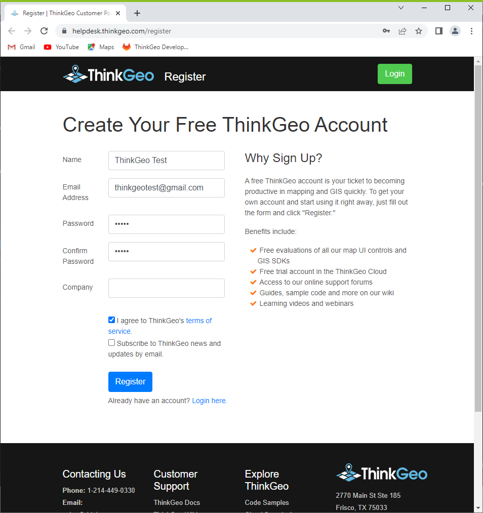
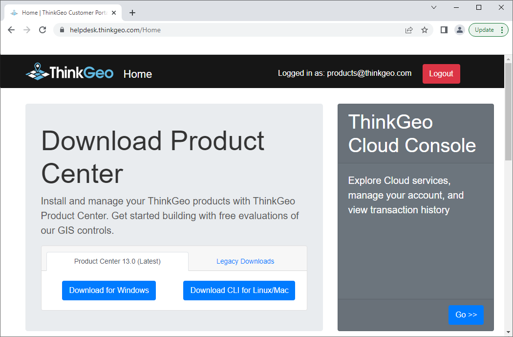
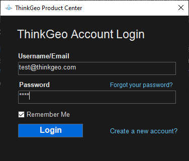
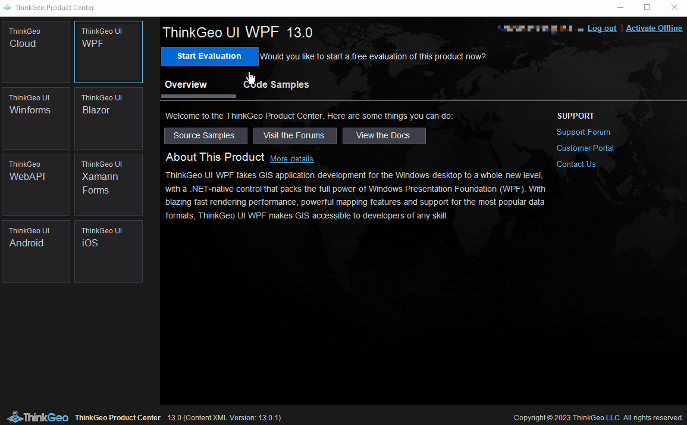
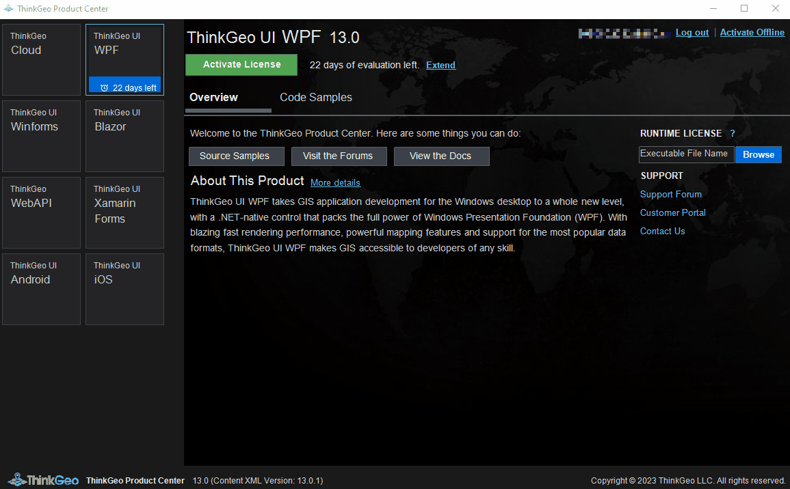
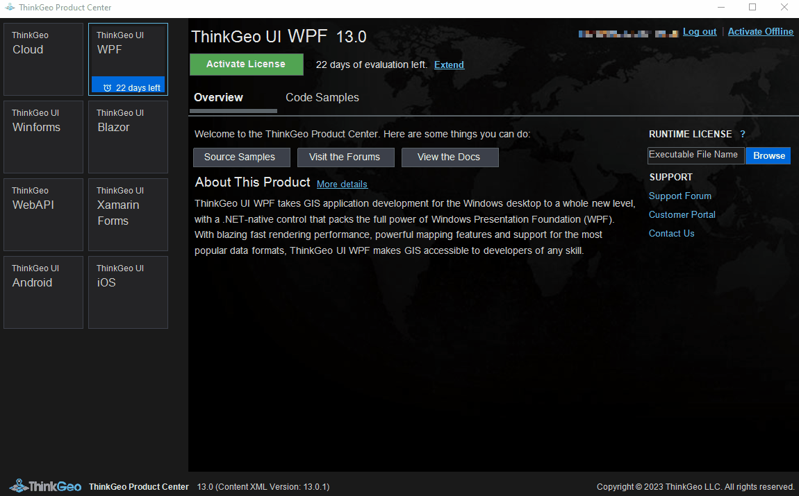

This guide will demonstrate how to register for a ThinkGeo account, download and install the Production Center, and activate and manage your ThinkGeo product licenses.

ThinkGeo offers two types of licenses: one for development and the other for runtime. The development license is required for developers to create and develop using ThinkGeo, and it comes with a fee. The runtime license is needed for the output executable file to function correctly, but it doesn't require payment.

In a scenario where a team has three people, with one person working on a map-related project while the other two work on map-unrelated projects, the team can purchase a single development license for the person working on the map-related project and generate runtime licenses for the other two people. Although their projects can run, they will not be able to view the maps.

# ThinkGeo Production Center: Manage all ThinkGeo Products Licenses

### Step 1: Register for your free evaluation

Visit [ThinkGeo's registration website](https://helpdesk.thinkgeo.com/register) to create an account and begin a 30-day free evaluation. 

### Step 2: Download and install ThinkGeo Production Center

Once you log in to the website, you can download the ThinkGeo Production Center. There are two options available: the GUI version for Windows and the CLI version for Linux/Mac.

To install the GUI version for Windows, click the "Download for Windows" button to start downloading.  

Once the download is complete, double-click the downloaded "ThinkGeo.ProductCenter.exe" file to install the ThinkGeo Production Center. Then, log in using your registered account.

### Step 3: Activate and manage ThinkGeo products licenses

After logging in, you will be directed to the following page. Here, you can activate your development licenses for ThinkGeo products by selecting the corresponding buttons. 

In addition, you can use the Production Center to generate runtime licenses for your output EXE file. 

You can also activate ThinkGeo products offline by generating and sending the request file via email to ThinkGeo. Once you receive the license file, you can import it to activate the product.

