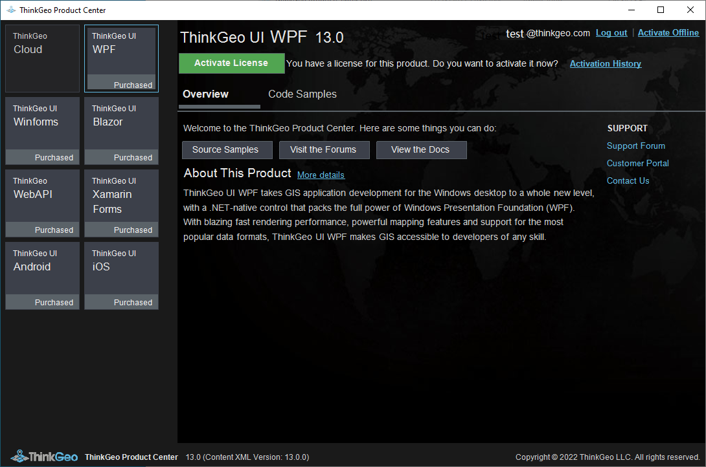

This guide will demonstrate how to register for a ThinkGeo account, download and install the Production Center,  activate and manage your ThinkGeo products.

# ThinkGeo Production Center: Manage all ThinkGeo Products Licenses

### Step 1: Register for Your Free Evaluation

Visit [ThinkGeo's registration website](https://helpdesk.thinkgeo.com/register) to create an account and begin a 30-day free evaluation. 

### Step 2: Download and install ThinkGeo Production Center

Once you login to the website, you can find the instructions for downloading and installing the Production Center. 

Double click the downloaded "ThinkGeo.ProductCenter.exe" file to install the ThinkGeo Production Center, login by using your registered account.

### Step 3: Activate and manage ThinkGeo products licenses

Now you can activate your ThinkGeo products licenses by choosing corresponding buttons. 

Additionally you can manage your licenses for ThinkGeo products from within the Production Center. 

