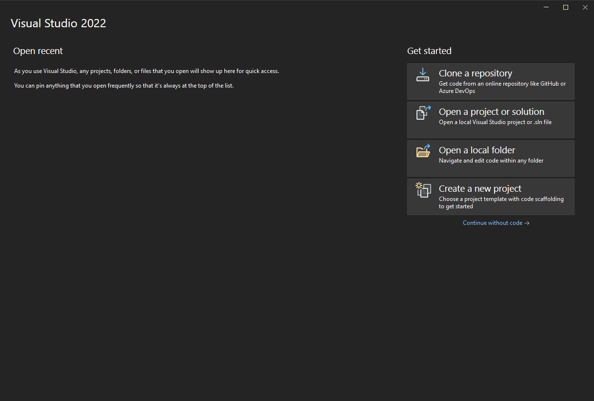
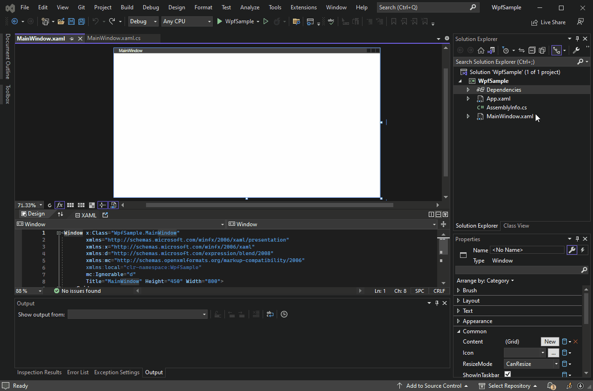
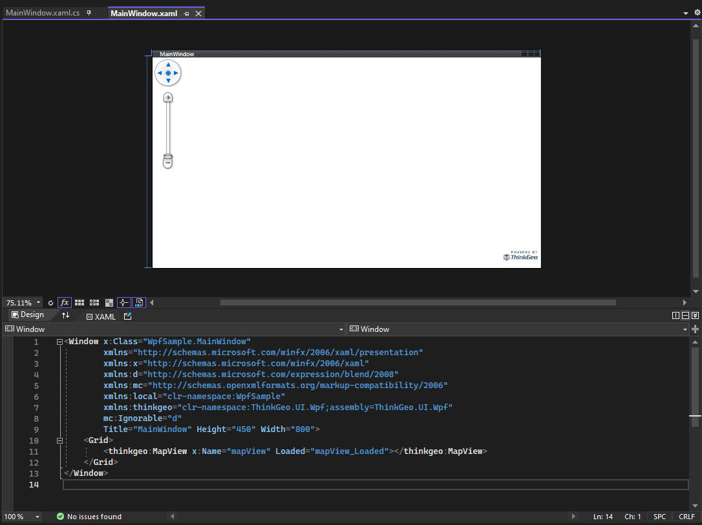

This guide is based on using Visual Studio 2022. However, with some minor adjustments, you can create a map using other IDEs, such as JetBrains Rider. You can also [display a map in a WPF project using VS Code](todo).

The project created in this guide is developed in .NET 7, but you can also create a .NET Framework (4.6.2 and above)  project using practically the same steps.

# Desktop Maps Quick Start: Display a Simple Map using WPF

In this section, we'll show you how to create a visually appealing map with external data and styling. We highly recommend that you also take a look at the [How Do I Sample](https://gitlab.com/thinkgeo/public/thinkgeo-desktop-maps/-/tree/master/samples/wpf/HowDoISample), which contains numerous examples that cover virtually everything you can do with the control.

First, to begin working on the map, you'll need to create a .NET WPF project using Visual Studio 2022. Once that's done, we'll guide you through the process of adding the required packages and getting the map set up on the default form. Next, we'll show you how to add a background and a shapefile to the map, and also how to customize it with styles.

### Step 1: Create a WPF Project
Create a C# WPF project with .NET 7.0. 



### Step 2: Add Nuget Packages: 

Install **ThinkGeo.UI.Wpf** NuGet package through NuGet package manager.

You can switch between the Beta Branch and Release Branch by checking/unchecking the "Include prerelease" checkbox. The Beta Branch contains the latest features/bug fixes, while the Release Branch is more stable and better tested.



### Step 3: Add the Map Control to `MainWindow.xaml`

Add ThinkGeo.UI.Wpf namespace to `MainWindow.xaml` 

```xml
xmlns:thinkgeo="clr-namespace:ThinkGeo.UI.Wpf;assembly=ThinkGeo.UI.Wpf"
```

Add the map control within `Grid` element in `MainWindow.xaml` file.

```xml
<thinkgeo:MapView x:Name="mapView" Loaded="mapView_Loaded"></thinkgeo:MapView>
```



### Step 4: Add the ThinkGeo Background
Import the namespace at the top of 'MainWindow.xaml.cs` file.

```csharp
using ThinkGeo.Core;
```

Add the following code to the mapView_Loaded event, which is triggered when the map view is fully loaded and ready to use. (The key passed in ThinkGeoCloudVectorMapsOverlay is for test only, you can apply for your own key from [ThinkGeo Cloud](https://cloud.thinkgeo.com/clients.html))

We have set up a tile cache for the base overlay to improve performance. The cache retrieves tiles from the local disk instead of downloading them from the internet each time they are needed.

```csharp
private void mapView_Loaded(object sender, RoutedEventArgs e)
{
    mapView.MapUnit = GeographyUnit.Meter;
    // Add a base map overlay.
    var baseOverlay = new ThinkGeoCloudVectorMapsOverlay("USlbIyO5uIMja2y0qoM21RRM6NBXUad4hjK3NBD6pD0~", "f6OJsvCDDzmccnevX55nL7nXpPDXXKANe5cN6czVjCH0s8jhpCH-2A~~", ThinkGeoCloudVectorMapsMapType.Light);
    // Set up the tile cache for the base overlay, passing in the location and an ID to distinguish the cache. 
    baseOverlay.TileCache = new FileRasterTileCache(@".\cache", "basemap");
    mapView.Overlays.Add(baseOverlay);

    // Set the extent of the mapView
    mapView.CurrentExtent = MaxExtents.ThinkGeoMaps;

    mapView.Refresh(); 
}
```
### Step 5: Run the Sample & Register for Your Free Evaluation

The first time you run your application, if you have not installed a license, you may encounter a 'licenses not installed' exception. 


Also you will be directed to ThinkGeo's registration website, where you can create an account to begin a 30-day free evaluation. From there, you can download and install the Product Center and manage licenses for ThinkGeo products. For more information, please refer to the [ThinkGeo Product Center QuickStart Guide](https://cloud.thinkgeo.com/clients.html). 


Once you activate the 'ThinkGeo UI WPF' license to start your evaluation, you should be able to see the map with our Cloud Maps layer! You can double-click to zoom in, use the mouse wheel to zoom in/out, and track zoom in by holding down the Shift key and tracking the map. Additionally, you can rotate the map by holding down the Alt key and dragging the map.


### Step 6: Add a Point Data Layer to the map

Now that you have a basic setup, you can add custom data to the map. Depending on the data, this can be complex or quite simple. Here we are going to add a shapefile to the map. We will set the style for the shapefile, apply the style to a range of zoomlevels, and project the shapefile from one projection (Decimal Degrees) to another (Spherical Mercator). This is basically what you might need to do when displaying feature data on the map.

Download the [WorldCapitals.zip](https://gitlab.com/thinkgeo/public/thinkgeo-desktop-maps/-/tree/master/assets/WorldCapitals.zip) shapefile data and unzip it in your project under a new folder called AppData. From there, we can add the shapefile to the map.

```csharp
// Add a shapefile layer with point style.
var capitalLayer = new ShapeFileFeatureLayer(@"..\..\..\AppData\WorldCapitals.shp");
var capitalStyle = new PointStyle()
{
    SymbolType = PointSymbolType.Circle,
    SymbolSize = 8,
    FillBrush = new GeoSolidBrush(GeoColors.White),
    OutlinePen = new GeoPen(GeoColors.Black, 2)
};
// Have set the default to have 20 zoom levels in the layer and applied the style to zoomlevel01, which can also be applied to other zoomlevels.
capitalLayer.ZoomLevelSet.ZoomLevel01.DefaultPointStyle = capitalStyle;
capitalLayer.ZoomLevelSet.ZoomLevel01.ApplyUntilZoomLevel = ApplyUntilZoomLevel.Level20;

// The shapefile is in Decimal Degrees, while the base overlay is in Spherical Mercator. It's why the shapefile needs to be reprojected to match the coordinate system of the base overlay.
capitalLayer.FeatureSource.ProjectionConverter = new ProjectionConverter(Projection.GetDecimalDegreesProjString(), Projection.GetSphericalMercatorProjString());

// Add the layer to an overlay, add that overlay to the map.
var customDataOverlay = new LayerOverlay();
customDataOverlay.Layers.Add(capitalLayer);
mapView.Overlays.Add(customDataOverlay);           
```
Now, the data shows up properly on the map!


## Summary

You now have a basic understanding of how to use the ThinkGeo Map controls and can begin adding functionality to your own applications. Let's review what we've learned about the object relationships and how the pieces of ThinkGeo UI work together:

1. A `MapView` is the fundamental control that contains all the other objects used to determine how the map is rendered.
2. A `MapView` has multiple `Overlays`, and each `Overlay` corresponds to a tier of images displayed on the map control.
3. A `LayerOverlay` has multiple layers, and each `Layer` corresponds to a single data source. This can be a vector-based `FeatureLayer` (such as a shapefile or SQLite) or a raster-based `RasterLayer` (such as TIFF or MrSID).
4. A `FeatureLayer` can have multiple `ZoomLevels`, which define the upper and lower ranges of when a layer should be shown or hidden, and the styles for how the layer is supposed to be displayed.
5. The `MapUnit` (feet, meters, decimal degrees, etc.) and `CurrentExtent` need to be correctly set for the `Map` control.

Congratulations, you are now in an excellent position to review the [How Do I Sample](https://gitlab.com/thinkgeo/public/thinkgeo-desktop-maps/-/tree/master/samples/wpf/HowDoISample) and explore other features.
