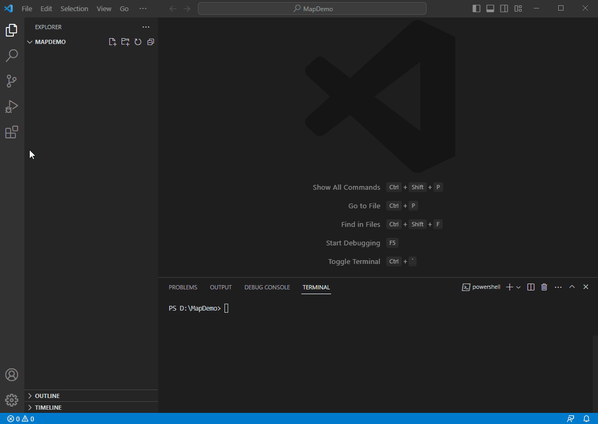
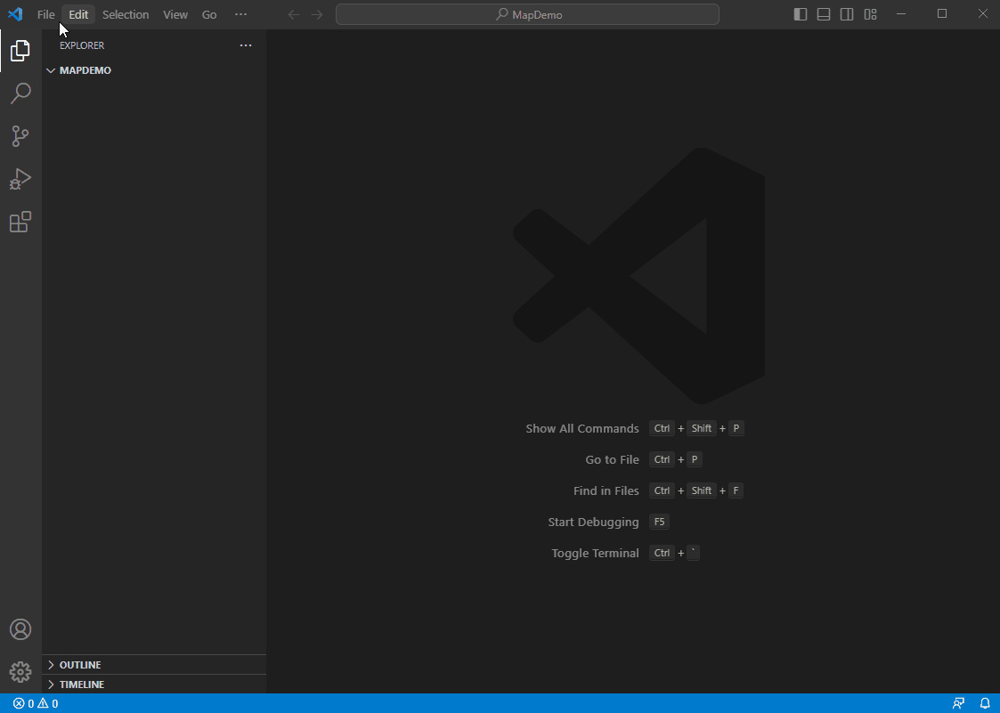
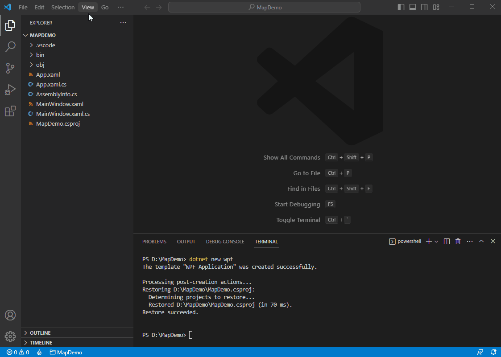

This guide is based on using VS Code in .Net 7 WPF. There are tons of map services we can use to set up a base map, however, only a few articles talk about how to do it for a Desktop project, and they are all over-complicated. In this article, I will cover how to simply create a desktop WPF application that shows a 3rd party background map using VS Code.  

# Desktop Maps Quick Start: Display a Simple Map using VS Code

In this section, we'll show you how to create a visually appealing map using VS Code. 

First, to begin working on the map, you'll need to create a  VS Code project using **Visual Studio Code**. Once that's done, we'll guide you through the process of adding the required packages and getting the map set up on the default form. 

Next, we'll show you how to add a background to the map.

### Step 1: Setup VS Code

VS Code is a lightweight, open source development environment loved by millions of developers. I'm going to finish today's project using VS Code. This project will use .NET 7.0 on a Windows machine.

First, install [.NET 7.0 SDK x64](https://dotnet.microsoft.com/en-us/download)

Second, make sure "C#" and "NuGet Package Manager" extensions have been installed in VS Code. Click the Extensions button on the left in VS Code, search the 2 extensions by name and install them. You will see them under INSTALLED group once finished.



### Step 2: Create a WPF Project

To create a new WPF project using VS Code, follow these steps:

First, select **File → Open Folder** and choose a blank folder. If the TERMINAL window is not already open, select **Terminal → New Terminal** to open it. In this example, we will use the folder "D:\MapDemo", which will also be visible in the terminal. The name of the folder, "MAPDEMO," should show up in the explorer window on the left.

Second, create a WPF project by typing "**dotnet new wpf**" in the terminal and pressing enter. The project will be created, and the newly generated files can be seen in the explorer window on the left.

Next, select **View → Command Palette** and choose **.NET: Generate Assets for Build and Debug** to generate assets for building and debugging.

To begin debugging, press F5 or select **Run → Start Debugging**. If a blank window appears, congratulations! Your project is set up correctly.



### Step 3: Add Nuget Packages

Install **ThinkGeo.UI.Wpf** NuGet package through NuGet package manager.

Select **View → Command Palette** and select **NuGet Package manager: Add Package**. The Nuget Package Search Box will pop up, type in "ThinkGeo.UI" and hit enter, go ahead and select **ThinkGeo.UI.Wpf** from the popping list.

Then select the latest version (13.1.0-beta012 in my case), click on it and the package is now added to the project.Then you will be prompted to restore the unresolved dependencies, hit Restore and the Nuget packages will be downloaded, and we are ready to go.



### Step 4: Add the Map Control to `MainWindow.xaml`

Add ThinkGeo.UI.Wpf namespace to `MainWindow.xaml`

```xml
xmlns:thinkgeo="clr-namespace:ThinkGeo.UI.Wpf;assembly=ThinkGeo.UI.Wpf"
```
Add the map control within `Grid` element in `MainWindow.xaml` file.

```xml
<thinkgeo:MapView x:Name="mapView"></thinkgeo:MapView>
```


### Step 5: Add the ThinkGeo Background
Import the namespace at the top of 'MainWindow.xaml.cs` file.

```csharp
using ThinkGeo.Core;
```
Add the following code to the mapView_Loaded event, which is triggered when the map view is fully loaded and ready to use. (The key passed in ThinkGeoCloudVectorMapsOverlay is for test only, you can apply for your own key from [ThinkGeo Cloud](https://cloud.thinkgeo.com/clients.html))

```csharp
private void mapView_Loaded(object sender, RoutedEventArgs e)
{
    // Set the Map's Unit to Meter.
    mapView.MapUnit = GeographyUnit.Meter;
    // Set the Current Extent to the Max Extent of ThinkGeo Map.
    mapView.CurrentExtent = MaxExtents.ThinkGeoMaps;
        
    // Add a base map overlay.
    var backgroundOverlay = new ThinkGeoCloudVectorMapsOverlay("itZGOI8oafZwmtxP-XGiMvfWJPPc-dX35DmESmLlQIU~", 
      "bcaCzPpmOG6le2pUz5EAaEKYI-KSMny_WxEAe7gMNQgGeN9sqL12OA~~", ThinkGeoCloudVectorMapsMapType.Light);
        
    // Add the newly created overlay to mapView.
    mapView.Overlays.Add(backgroundOverlay);
        
    // Refresh the Map
    mapView.Refresh();
}
```
