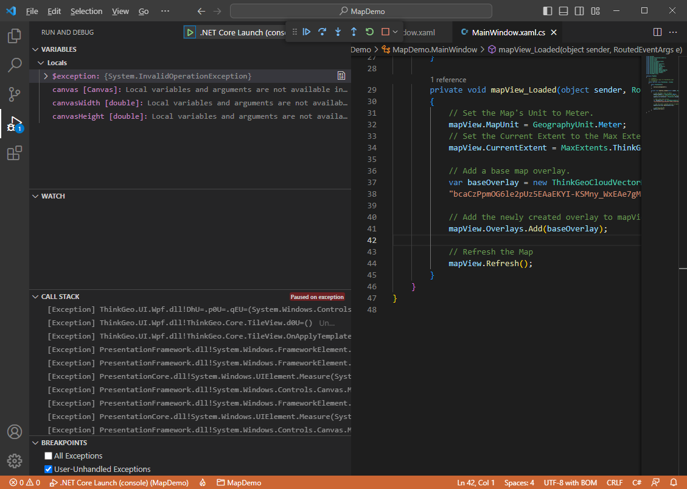

In this article, we will demonstrate how to create an aesthetically pleasing map in a desktop project using VS Code. The project is designed for Windows and uses .Net 7. However, you can also create a similar .Net Framework/.Net Core project using Visual Studio. 

# Desktop Maps Quick Start: Display a Simple Map using VS Code

To begin working on the map, you will need to create a project in VS Code. Afterwards, we will guide you through the process of adding the required packages and setting up the map by adding a background.

### Step 1: Setup VS Code

First, install [.NET 7.0 SDK x64](https://dotnet.microsoft.com/en-us/download)

Second, ensure that the "C#" and "NuGet Package Manager" extensions are installed in VS Code. To do this, click on the Extensions button on the left-hand side of VS Code, search for the two extensions by name, and install them. Once the installation is complete, you will find them under the INSTALLED group.


### Step 2: Create a WPF Project

First, select **File → Open Folder** and choose a blank folder. If the TERMINAL window is not already open, select **Terminal → New Terminal** to open it. In this example, we will use the folder "D:\MapDemo", which will also be visible in the terminal. The name of the folder, "MAPDEMO," should show up in the explorer window on the left.

Second, create a WPF project by typing "**dotnet new wpf**" in the terminal and pressing enter. The project will be created, and the newly generated files can be seen in the explorer window on the left.

Next, select **View → Command Palette** and choose **.NET: Generate Assets for Build and Debug** to generate assets for building and debugging.

To begin debugging, press F5 or select **Run → Start Debugging**. If a blank window appears, congratulations! Your project is set up correctly.


### Step 3: Add Nuget Packages

First, select **View → Command Palette** and choose **NuGet Package Manager: Add Package**. This will open the NuGet Package Search Box. Type "ThinkGeo.UI" into the search box and press Enter. From the list that appears, select **ThinkGeo.UI.Wpf**.

Next, select the latest version of the package (in my case, it's version 13.1.0-beta012, you can also install a release version(no beta)). Click on the version to add it to the project. You will then be prompted to restore any unresolved dependencies. Click Restore to download the necessary NuGet packages, and you're all set!


### Step 4: Add the ThinkGeo Background

Add ThinkGeo.UI.Wpf namespace to `MainWindow.xaml`

```xml
xmlns:thinkgeo="clr-namespace:ThinkGeo.UI.Wpf;assembly=ThinkGeo.UI.Wpf"
```
Add a map control named 'mapView' to the Grid element in MainWindow.xaml, and include the mapView_Loaded event.

```xml
<thinkgeo:MapView x:Name="mapView" Loaded="mapView_Loaded"></thinkgeo:MapView>
```
Import the namespace at the top of 'MainWindow.xaml.cs` file.

```csharp
using ThinkGeo.Core;
```
Add the following code to the mapView_Loaded event, which is triggered when the map view is fully loaded and ready to use. (The key passed in ThinkGeoCloudVectorMapsOverlay is for test only, you can apply for your own key from [ThinkGeo Cloud](https://cloud.thinkgeo.com/clients.html))

Set up a tile cache for the base overlay to improve performance. The cache retrieves tiles from the local disk instead of downloading them from the internet each time they are needed.

```csharp
private void mapView_Loaded(object sender, RoutedEventArgs e)
{
  // Set the Map's Unit to Meter.
  mapView.MapUnit = GeographyUnit.Meter;
  // Set the Current Extent to the Max Extent of ThinkGeo Map.
  mapView.CurrentExtent = MaxExtents.ThinkGeoMaps;
                
  // Add a base map overlay.
  var baseOverlay = new ThinkGeoCloudVectorMapsOverlay("itZGOI8oafZwmtxP-XGiMvfWJPPc-dX35DmESmLlQIU~", 
      "bcaCzPpmOG6le2pUz5EAaEKYI-KSMny_WxEAe7gMNQgGeN9sqL12OA~~", ThinkGeoCloudVectorMapsMapType.Light);
  // Set up the tile cache for the base overlay, passing in the location and an ID to distinguish the cache.     
  baseOverlay.TileCache = new FileRasterTileCache(@".\cache", "basemap");

  // Add the newly created overlay to mapView.
  mapView.Overlays.Add(baseOverlay);
                
  // Refresh the Map
  mapView.Refresh();
}
```

### Step 6: Run the Sample & Register for Your Free Evaluation

The first time you run your application, if you have not installed a license, you may encounter a 'licenses not installed' exception. 



Also you will be directed to ThinkGeo's registration website, where you can create an account to begin a 30-day free evaluation. From there, you can download and install the Product Center and manage licenses for ThinkGeo products. For more information, please refer to the [ThinkGeo Product Center QuickStart Guide](https://cloud.thinkgeo.com/clients.html). 


Once you activate the 'ThinkGeo UI WPF' license to start your evaluation, you should be able to see the map with our Cloud Maps layer! You can double-click to zoom in, use the mouse wheel to zoom in/out, and track zoom in by holding down the Shift key and tracking the map. Additionally, you can rotate the map by holding down the Alt key and dragging the map.


## Summary

You now have a basic understanding of how to use the ThinkGeo Map controls in VS Code and can begin adding functionality to your own applications. Let's review what we've learned about the object relationships and how the pieces of ThinkGeo UI work together:

1. A `MapView` is the fundamental control that contains all the other objects used to determine how the map is rendered.
2. A `MapView` has multiple `Overlays`, and each `Overlay` corresponds to a tier of images displayed on the map control.
3. The `MapUnit` (feet, meters, decimal degrees, etc.) and `CurrentExtent` need to be correctly set for the `Map` control.

Congratulations, you are now in an excellent position to review the [How Do I Sample](https://gitlab.com/thinkgeo/public/thinkgeo-desktop-maps/-/tree/master/samples/wpf/HowDoISample) and explore other features.
