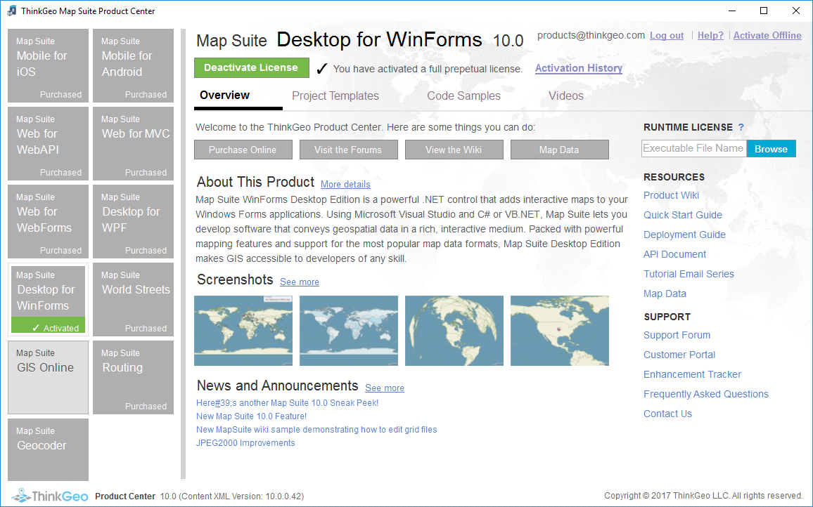
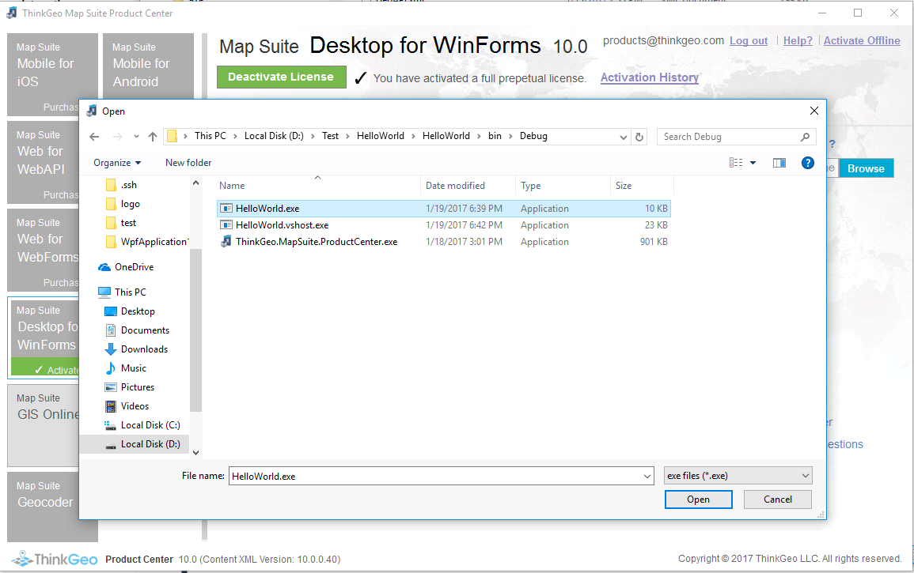
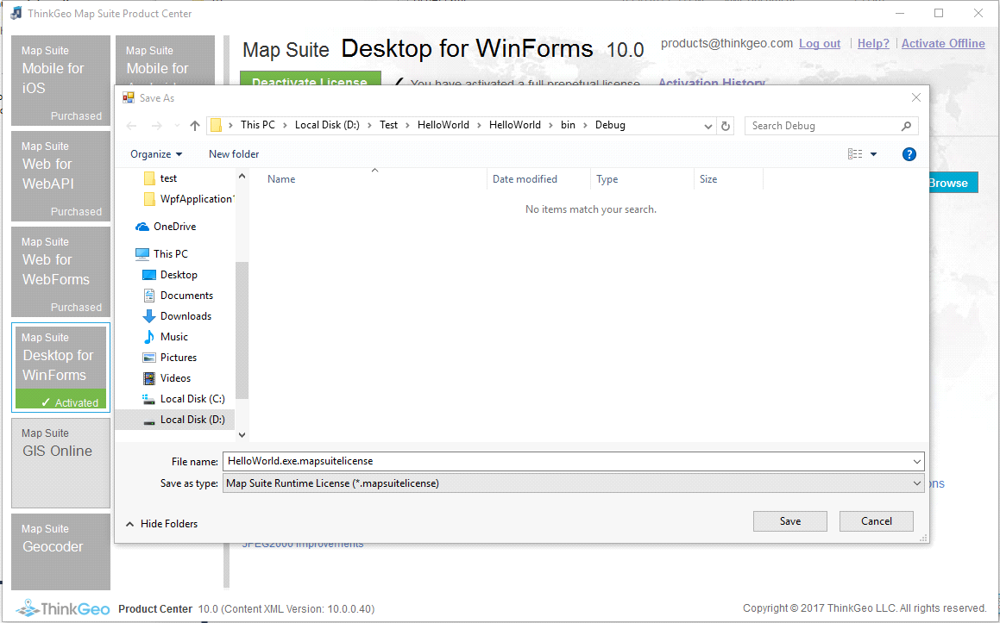

# Deployment

If you need to publish a desktop application that was developed with ThinkGeo UI for WPF components, it's required to publish your application along with the Runtime License. Otherwise, a map will be rendered with "Not Licensed for Run Time". This guide demonstrate how to setup the runtime license.

## Get Runtime License

A Runtime License can be generated by “ThinkGeo Product Center” which can be found from your application's bin folder (The same folder of the compiled *.exe file). Please double click ThinkGeo.MapSuite.ProductCenter.exe and switch to ThinkGeo UI Desktop for WPF tab as indicated in the figure below.

Click the Browse button on the right below RunTime License (The button is not available unless the product is activated) and select the application that you want to publish.

A “Save As” dialog will pop up after the application is selected. Click the "Save" button to generate runtime license file(*.mapsuitelicense) on your disk.

## Deploying Applications

All the dependencies will be copied into the bin folder except for Visual C++ Redistributable from Microsoft (it's required for some of the features), which can be downloaded from the following link.

* [Visual C++ Redistributable for Visual Studio 2015, 2017 and 2019](https://www.microsoft.com/en-US/download/details.aspx?id=48145)
