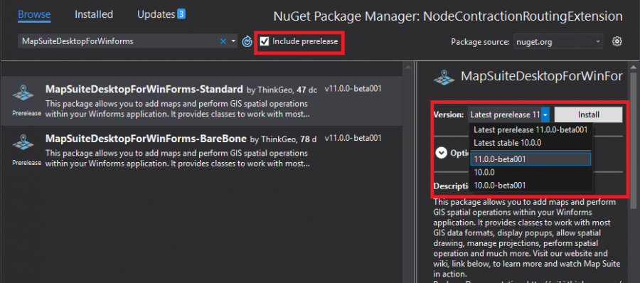

# Nuget Package Guide

## ThinkGeo via NuGet

In ThinkGeo 10.0 we have started to provide our products via packages on NuGet.  This will allow references to our products to be added and updated easily.  We have three different types of packages on NuGet: feature packages, dependency packages, and product packages. These will be explained in detail below.  Each of these packages will also have two different build branches: production and development.

### ThinkGeo NuGet Packages

We have three different types of packages: feature packages, dependency packages, and product packages.  You can tell the difference between these packages by their name.  Feature Packages begin with "ThinkGeo.MapSuite" and are named for the namespace and class that they contain. Dependency Packages begin with "MapSuiteDependency" and contain repackaged third party dependencies. Product packages are named for what product they support and their name ends with either Standard or Barebone.

### Feature Packages

Feature packages contain one specific feature, such as a data source, and can be added or removed from your product as needed. The package name is usually the same as the assembly and the name of the class that it provides is prefixed by the namespace that it is added in.

### Product Packages

Product packages are a collection of packages used in specific products.  Each product has a Standard version and a Barebone version which each provide different levels of features with Standard having most of the features that you will need and Barebone not including only the most basic features. You can install and uninstall feature packages as desired on top of these.  You can see more about the coverage on each of the products later on in this document.

### Dependency Packages

Dependency packages are third party dependencies that we have repackaged to references within our packages.  There should never be a need to install these manually.  You can find more information on which versions our dependencies use in our [third party library page.](3rd-party-libraries.md).

### Why We Repackage

The 3rd party dependencies included in the Dependency Packages are needed by our feature packages.  Sometimes these packages can release updates that break compatibility with our APIs and some of the packages do not provide older versions for download.  Because of these issues, we repackage the dependencies so that we have complete control of which versions of the dependency packages we use.

Repackaging also allows us to keep the dependencies for each of our feature packages well organized and consistent.

### Production Builds (Stable) through NuGet

Production builds in NuGet are our well-tested assemblies and for the most part the ones we suggest using.  They all have a three-number version number which relates to the Major, Minor, and Patch versions.  For example, 10.1.2 where 10 is the major version, 1 is the minor version, and 2 is the patch version.

### Hotfix

Hotfixes are released when we want a code change to be immediately applied to the production build.  These are generally bug fixes and will rarely, if ever add features.  There will be no API breaking changes and typically new APIs will not be added in a hotfix release.

### Minor Release

Minor releases will be periodically released to add new features once they have been tested.  These updates will also contain all of the hotfix changes released previously.  For example 10.2.0 will include every change in hotfixes for the previous minor release version.

### Daily Development Build (Unstable) through NuGet

The Development Branch is built daily which means that new changes will be available the day after they are made.  These versions will always have the latest features as we add them, but may not be tested fully yet, and the APIs for the new features may change through development. The version numbers for daily builds are the next major version suffixed with "beta" and a build number. For example: 11.0.0-Beta002.

If you want to install the daily builds, you can follow these steps:

- Open NuGet Package Manager
- Input package you wish to install in the search field.
- Check "Include Prerelease" option to the right of the search field.
- In the version dropdown, select an option with a beta version listed such as 11.0.0-Beta001.
- Install using the install button.  

## ThinkGeo Products Platform Coverage

ThinkGeo UI products can run on various platforms. Here shows the platform coverage for each product.

|Product|Windows|Linux|Mac|
|---|---|---|---|
|Desktop for WPF                               |✔              |              |  |
|Web for Blazor                                |✔               |✔             |✔|

* ✔: Fully Supported / Tested.
* –: Not Full Tested.

## ThinkGeo Nuget Package Platform Coverage

ThinkGeo components has multiple Nuget Packages which can runs on one or more platforms. Here shows platform coverage for each package.

|Nuget Package|Framework|Windows|Linux|Mac|
|---|---|---|---|---|
|ThinkGeo.Core                 | .NET Standard 2.1         |✔            |✔           |✔  |
|ThinkGeo.Gdal                 | .NET Standard 2.1         |✔            |✔           |✘  |  
|ThinkGeo.Ecw                  | .NET Standard 2.1         |✔            |✔           |✘  |
|ThinkGeo.UmanagedGeoTiff      | .NET Standard 2.1         |✔            |✔           |✘  |
|ThinkGeo.Jpeg2000             | .NET Standard 2.1         |✔            |✔           |✘  |
|ThinkGeo.MrSid                | .NET Standard 2.1         |✔            |✔           |✘  |
|ThinkGeo.UmanagedProj         | .NET Standard 2.1         |✔            |✔           |✘  |
|ThinkGeo.NauticalCharts       | .NET Standard 2.1         |✔            |✔           |✘  |
|ThinkGeo.FileGeoDatabase      | .NET Standard 2.1         |✔            |✔           |✘  |
|ThinkGeo.PersonalGeoDatabase  | .NET Standard 2.1         |✔            |✘           |✘  |
|ThinkGeo.Oracle               | .NET Standard 2.1         |✔            |✘           |✘  |
|ThinkGeo.SqlServer            | .NET Standard 2.1         |✔            |✔           |✘  |
|ThinkGeo.PostgreSql           | .NET Standard 2.1         |✔            |✔           |✘  |
|ThinkGeo.Printers             | .NET Standard 2.1         |✔            |✘           |✘  |
|ThinkGeo.UI.Wpf               | .NET Core 3.0             |✔            |✘           |✘  |
|ThinkGeo.UI.Blazor            | .NET Standard 2.1         |✔            |✔           |✘  |

* ✔: Done
* ✘: Not Supported
* O: Not supported for now and will support in the future
  