# Upgrade Guide

## Map Suite 10.0 vs ThinkGeo 12.0

The update to ThinkGeo 12.0 introduces a lot of exciting changes we have made to MapSuite. This guide will walk you through all of the changes and how to upgrade from 10.0 to 12.0 for your existing project. You can see an overview of these changes in the table below.

||MapSuite9.0|MapSuite 10.0|ThinkGeo 12.0|Benefits|
|---|---|---|---|---|
| Core Functionality Assembly    |  MapSuiteCore.dll   |   Split into many assemblies        |  Merge many assemblies into ThinkGeo.Core.dll |  Get the features you need  |
| Core Functionality API    |   The MapSuiteCore's API is different from the API in iOS/Android   |   Same across all the products   |  Same across all the products|  No need for multiple changes like before  |
| Core Functionality Platforms supported    |   Windows, iOS*, Android*    |  Windows, Linux*, MacOS*, iOS, Android    |  Windows, Linux*, MacOS*, iOS, Android    |   Now supporting .net core   |
| Distribution and updates |   Through Map Suite Product Center     |   Through Nuget      |  Through Nuget      |  Much simpler, streamlined ability to update and install   |
| Samples   |   Map Suite Wiki     |   Map Suite Wiki and Github   | Map Suite Wiki and Github   |  More ways to get to our samples   |
| Dependencies of some features (like MrSid/ECW)    |   in Windows\System32     |  In bin folder   |  In bin\runtimes folder  |  Easier to deploy with less restrictions   |
| Licensing Strategy   |   Saved in Registry     |   File Based     |  File Based    |  Now works on the platforms without registry, like Amazon BeanStalk or Linux   |

## Upgrade To ThinkGeo 12

### Assembly Changes

With the marriage of Map Suite Core, some of the assemblies have now changed. ThinkGeo 12.0 has merged layers, styles, shapes and drawing assemblies into `ThinkGeo.Core.dll` so that you can access the features you need.  See the table below for examples of these changes:

|9.0|10.0|12.0|
|---|---|---|
|MapSuiteCore.dll | ThinkGeo.MapSuite.Layers.ShapeFile.dll  ThinkGeo.MapSuite.Layers.GoogleMaps.dll  ThinkGeo.MapSuite.Styles.ClassBreak.dll  ThinkGeo.MapSuite.Shapes.UnmanagedProj4Projection.dll  ThinkGeo.MapSuite.Drawing.PdfGeoCanvas.dll .......    |ThinkGeo.Core.dll    |
|WpfDesktopEdition.dll| ThinkGeo.MapSuite.Wpf.dll    | ThinkGeo.UI.Wpf.dll                        |
|WebApiEdition.dll| ThinkGeo.MapSuite.WebApi.dll    | ThinkGeo.UI.WebApi.dll                        |

### Namespaces Changes

In Map Suite 10.0, namespaces has been separated based on what its function is. Now, they mainly consist of two parts: `ThinkGeo.Core` and an edition namespace like `ThinkGeo.UI.Wpf`.

|9.0|10.0|
|---|---|
| ThinkGeo.MapSuite.Core |ThinkGeo.MapSuite contains common and basic classes for building Map Suite applications like GeographyUnit, GeoCollection, etc.  ThinkGeo.MapSuite.Drawing contains drawing-related classes likes GeoImage, GeoSolidBrush, etc  ThinkGeo.MapSuite.Layers contains some base classes like Layer, FeatureLayer, etc.  ThinkGeo.MapSuite.Shapes contains geometry-related classes likes PlygonShape, LineShape, etc.   ThinkGeo.MapSuite.Styles contains classes used for building map styles like AreaStyle, LineStyle, etc.  ....... |ThinkGeo.Core       |
| ThinkGeo.MapSuite.WpfDesktopEdition|ThinkGeo.MapSuite.Wpf     |ThinkGeo.UI.Wpf      |
| ThinkGeo.MapSuite.WebApiEdition|ThinkGeo.MapSuite.WebApi     |ThinkGeo.UI.WebApi      |

### API Changes

One big thing we decided to do is separate our Map Suite Core by functionality, such as shapes, layers, styles, symbologies, etc. There is still a low-level assembly that will be relied on by the other features. Some features have been changed to accommodate cross-platform support.

For example:

    // 9.0:
    public ShapeFileFeatureLayer(String shapePathFilename, ShapeFileReadWriteMode readWriteMode);

    // 10.0:
    public ShapeFileFeatureLayer(String shapePathFilename, GeoFileReadWriteMode readWriteMode);

    //12.0:
    public ShapeFileFeatureLayer(string shapePathFilename, FileAccess readWriteMode);

    // 9.0:
    public WmsRasterLayer(Uri uri, WebProxy webProxy);

    // 10.0:
    public WmsRasterLayer(Uri uri, IWebProxy webProxy);

    // 12.0:
    public WmsRasterLayer(Uri uri, IWebProxy proxy);

The changes to the `GeoFileReadWriteMode` and `FileAccess` features are updated to .NET standards.

### Remove The Old Assemblies and Install New Packages

Please remove the old assemblies from the project.

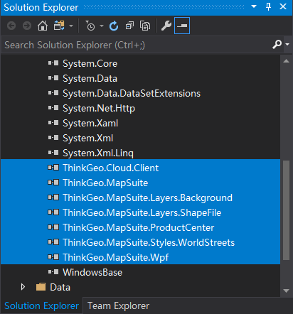

In order to add the new packages, you must first update the project file(.csproj) to use .NetCore 3.0.

Unload the project.

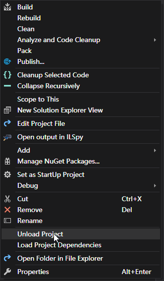

Update the project file.

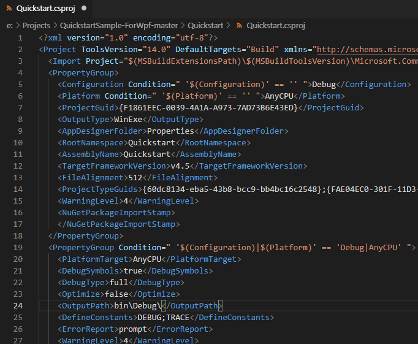

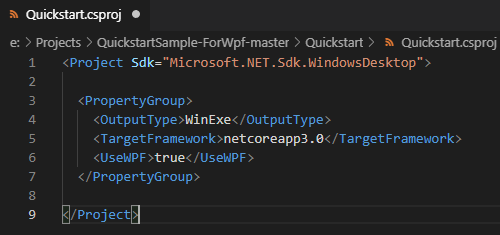

Reload the project.

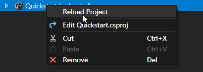

Remove the AssemblyInfo.cs

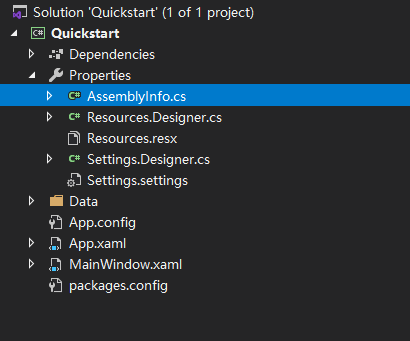

Next, the new packages will need to be installed. Search for `ThinkGeo.UI.Wpf` in the NuGet Package Manager and install the standard version.  Please click OK to accept changes and then accept the license agreements.

If you want to get more information, please refer to the NuGet installation guide.

### Change namespaces

Currently, the project still cannot build successfully as namespaces have changed in Map Suite 12.0. Some classes are marked with a red underline meaning this class is not found in all namespaces listed at the top of this file.

Right-Click on a class with a red underline and select `Quick Actions and Refactorings` and select the first item in the popup and the missing namespaces will add to the current file automatically.

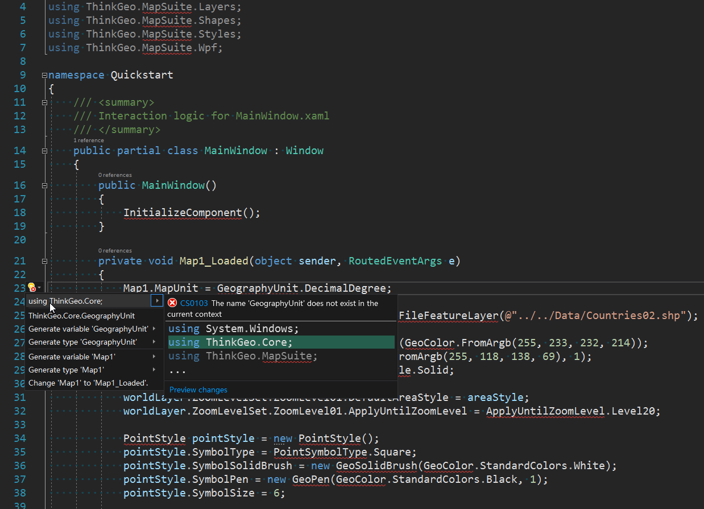

Also change the namespace in XAML:

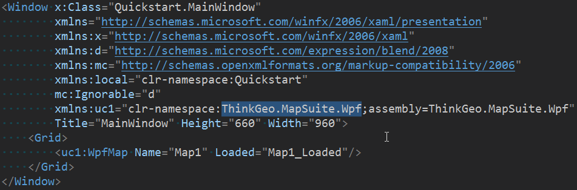

### Modify the necessary APIs

You will also need to manually change some of the classes to fit the new Map Suite 12.0 locations of the namespaces. The commented code is the previous code with the corrected code underneath. See the image below for reference:

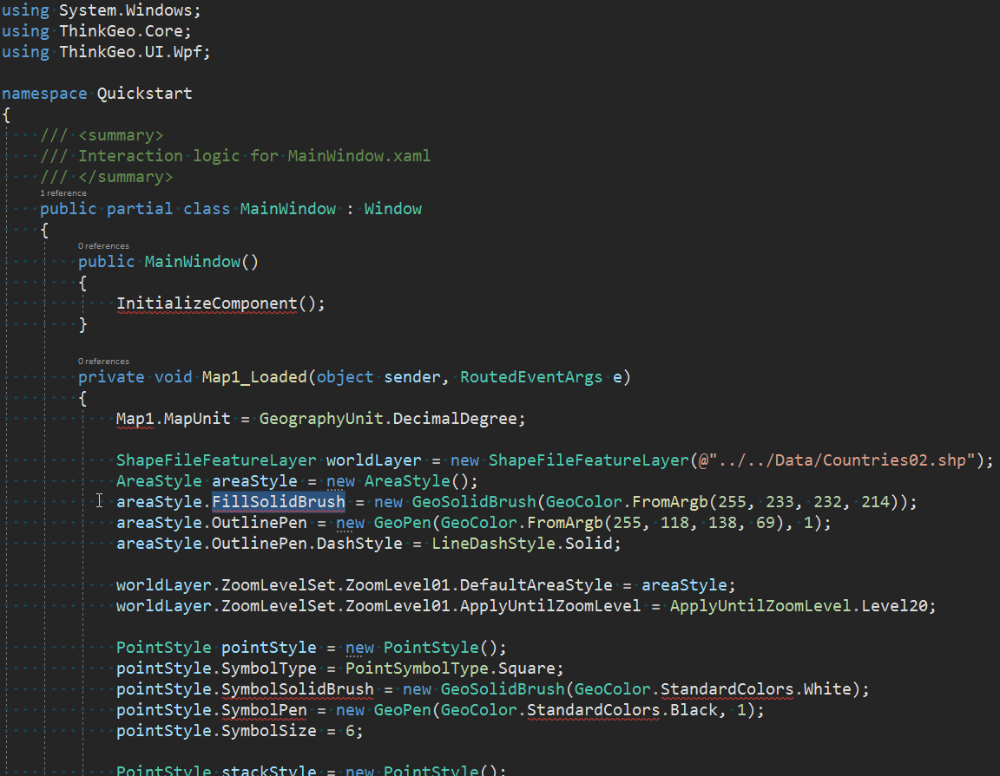

Change the `WpfMap` to `MapView` in XAML.

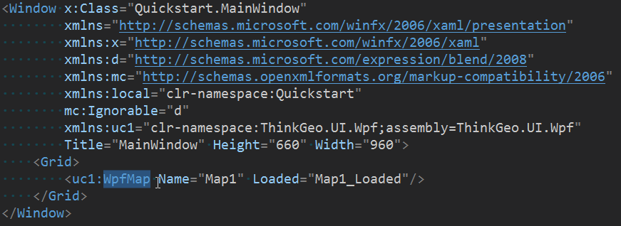

The default output directory is changed in `.NET Core 3.0`, So modify the relative path if used.

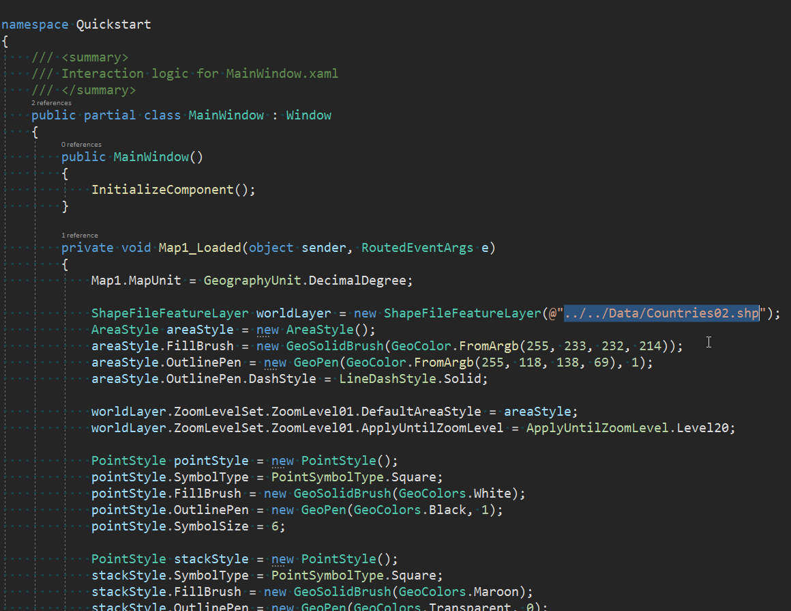

90% of the API stayed the same so that you won’t need to make many code changes. Of course, there are some exceptions to this, please refer [the change log](changelog.md) for details.

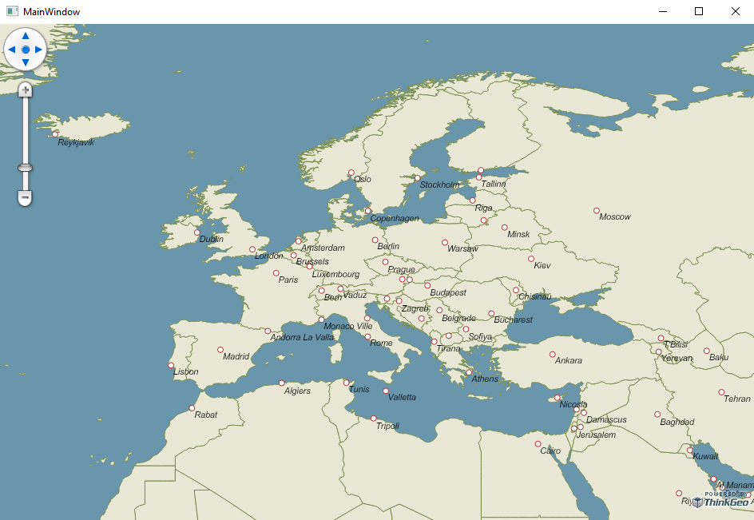

## FAQ

Here are answers to some of the most common questions that we are asked about the MapSuite 12.0 upgrade process. If you still have questions after reading these, feel free to post on our [Community Forums](https://community.thinkgeo.com/c/thinkgeo-ui-for-desktop).

### Where is GdiPlusXXX?

ThinkGeo 12.0 is based on .NET Core, so we use SkiaSharp instead of GdiPlus to render the map.

The new name is GdiPlusGeoCanvas now is something like PlatformGeoCanvas or SkiaGeoCanvas, GdiPlusRasterLayer now is NativeImageRasterLayer on Windows.

### How to use the WorldMapKit?

The `OsmWorldMapKitLayer` is no longer supported in version 12.

If you want to use WorldMapKit as background layer, please use `ThinkGeoCloudRasterMapsLayer` or `ThinkGeoCloudVectorMapsLayer` instead.

### What other breaking changes are there?

Please refer to the [changelog](changelog.md).
