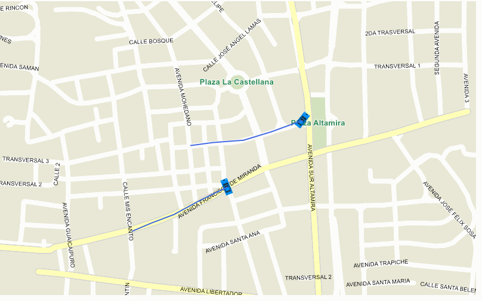

# Bread Crumb Trail Sample for WinForms

## Description

An early project of the Code Community, “Vehicle Direction”, showed how to rotate the icon of a moving vehicle based on the direction. In today’s project, we are going one step further and we are showing how to display dynamically a bread crumb trail as a trailing tail behind the moving vehicle. For this purpose, we are creating a new LineShape with the latest points at every new position.

Please refer to [Wiki](http://wiki.thinkgeo.com/wiki/map_suite_desktop_for_winforms) for the details.



## Requirements

This sample makes use of the following NuGet Packages

[MapSuite 10.0.0](https://www.nuget.org/packages?q=ThinkGeo)

## About the Code

```csharp
class RotatedImageStyle : Style
{
    protected override void DrawCore(IEnumerable<Feature> features, GeoCanvas canvas, Collection<SimpleCandidate> labelsInThisLayer, Collection<SimpleCandidate> labelsInAllLayers)
    {
        foreach (Feature feature in features)
        {
            float angleData = Convert.ToSingle(feature.ColumnValues[angleColumnName]);
            PointShape pointShape = (PointShape)feature.GetShape();
            canvas.DrawWorldImageWithoutScaling(geoImage, pointShape.X, pointShape.Y, DrawingLevel.LevelFour, 0, 0, 360 - angleData);
        }
     }
}
```

## Getting Help

[Map Suite Desktop for Winforms Wiki Resources](http://wiki.thinkgeo.com/wiki/map_suite_desktop_for_winforms)

[Map Suite Desktop for Winforms Product Description](https://thinkgeo.com/ui-controls#desktop-platforms)

[ThinkGeo Community Site](http://community.thinkgeo.com/)

[ThinkGeo Web Site](http://www.thinkgeo.com)

## Key APIs

This example makes use of the following APIs:

- [ThinkGeo.MapSuite.Styles.Style](http://wiki.thinkgeo.com/wiki/api/thinkgeo.mapsuite.styles.style)
- [ThinkGeo.MapSuite.Shapes.PointShape](http://wiki.thinkgeo.com/wiki/api/thinkgeo.mapsuite.shapes.pointshape)
- [ThinkGeo.MapSuite.Drawing.GeoCanvas](http://wiki.thinkgeo.com/wiki/api/thinkgeo.mapsuite.drawing.geocanvas)
- [ThinkGeo.MapSuite.Shapes.Feature](http://wiki.thinkgeo.com/wiki/api/thinkgeo.mapsuite.shapes.feature)

## About Map Suite

Map Suite is a set of powerful development components and services for the .Net Framework.

## About ThinkGeo

ThinkGeo is a GIS (Geographic Information Systems) company founded in 2004 and located in Frisco, TX. Our clients are in more than 40 industries including agriculture, energy, transportation, government, engineering, software development, and defense.
