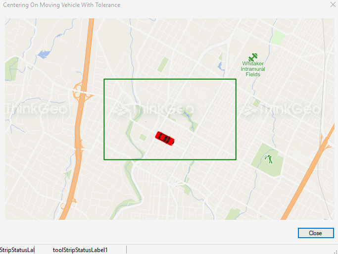

# Centering On Moving Vehicle With Tolerance Sample for WinForms

### Description
In the previous project, we showed how to center the map on a moving vehicle. While this is great, it has the disadvantage of having to refresh the map each time the vehicle changes position. In this project, we respond to this inconvenience by using a set tolerance used for determining if the map needs to be refreshed or not. If the vehicle moves within a rectangle of a certain size located in the center of the current extent of the map, the map will not refresh and only the moving vehicle will. If it moves outside the tolerance area, the entire map will be refreshed and the tolerance recalculated.

Please refer to [Wiki](http://wiki.thinkgeo.com/wiki/map_suite_desktop_for_winforms) for the details.



### Requirements
This sample makes use of the following NuGet Packages

[MapSuite 10.0.0](https://www.nuget.org/packages?q=ThinkGeo)

### About the Code
```csharp
RectangleShape toleranceRectangleShape = new RectangleShape(winformsMap1.CurrentExtent.UpperLeftPoint, winformsMap1.CurrentExtent.LowerRightPoint);
toleranceRectangleShape.ScaleDown(60);
if (toleranceRectangleShape.Contains(new PointShape(lng, Lat)) == false)
{
    winformsMap1.CenterAt(new PointShape(lng, Lat));

    //Resets the RectangleShape of the tolerance layer (for displaying only)
    LayerOverlay toleranceOverlay = (LayerOverlay)winformsMap1.Overlays["ToleranceOverlay"];
    InMemoryFeatureLayer toleranceLayer = toleranceOverlay.Layers["ToleranceLayer"] as InMemoryFeatureLayer;

    RectangleShape newToleranceRectangleShape = new RectangleShape(winformsMap1.CurrentExtent.UpperLeftPoint, winformsMap1.CurrentExtent.LowerRightPoint);
    newToleranceRectangleShape.ScaleDown(60);
    newToleranceRectangleShape.Id = "Tolerance";

    toleranceLayer.Open();
    toleranceLayer.EditTools.BeginTransaction();
    toleranceLayer.EditTools.Update(newToleranceRectangleShape);
    toleranceLayer.EditTools.CommitTransaction();
    toleranceLayer.Close();

    winformsMap1.Refresh();
}
else
{
    winformsMap1.Refresh(vehicleOverlay);
}
```
### Getting Help

[Map Suite Desktop for Winforms Wiki Resources](http://wiki.thinkgeo.com/wiki/map_suite_desktop_for_winforms)

[Map Suite Desktop for Winforms Product Description](https://thinkgeo.com/ui-controls#desktop-platforms)

[ThinkGeo Community Site](http://community.thinkgeo.com/)

[ThinkGeo Web Site](http://www.thinkgeo.com)

### Key APIs
This example makes use of the following APIs:
- [ThinkGeo.MapSuite.Shapes.RectangleShape](http://wiki.thinkgeo.com/wiki/api/thinkgeo.mapsuite.shapes.rectangleshape)
- [ThinkGeo.MapSuite.WinForms.LayerOverlay](http://wiki.thinkgeo.com/wiki/api/thinkgeo.mapsuite.winforms.layeroverlay)
- [ThinkGeo.MapSuite.Layers.InMemoryFeatureLayer](http://wiki.thinkgeo.com/wiki/api/thinkgeo.mapsuite.layers.inmemoryfeaturelayer)
- [ThinkGeo.MapSuite.Layers.EditTools](http://wiki.thinkgeo.com/wiki/api/thinkgeo.mapsuite.layers.edittools)

### About Map Suite
Map Suite is a set of powerful development components and services for the .Net Framework.

### About ThinkGeo
ThinkGeo is a GIS (Geographic Information Systems) company founded in 2004 and located in Frisco, TX. Our clients are in more than 40 industries including agriculture, energy, transportation, government, engineering, software development, and defense.
