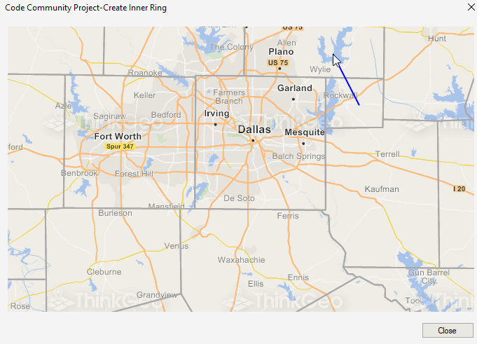

# Create Inner Ring Sample for WinForms

### Description
In this Desktop project we create inner rings for a polygon, based on another polygon, using the **GetDifference** method. We also learn how to perform a Union on a collection of polygons, and how to set up the **TrackEnded** event.

To use this app, you need to track a polygon, double click to end it, and it will create an inner ring based on the unioned result of the polygons that are completely within the tracked polygon. You can look at the **TrackEnded** event handler to see all the different operations that are taking place for that task.

Please refer to [Wiki](http://wiki.thinkgeo.com/wiki/map_suite_desktop_for_winforms) for the details.



### Requirements
This sample makes use of the following NuGet Packages

[MapSuite 10.0.0](https://www.nuget.org/packages?q=ThinkGeo)

### About the Code
```csharp
AreaBaseShape areaBaseShape = (AreaBaseShape)winformsMap1.TrackOverlay.TrackShapeLayer.InternalFeatures[0].GetShape();

LayerOverlay layerOverlay = (LayerOverlay)winformsMap1.Overlays["LayerOverlay"];
ShapeFileFeatureLayer shapeFileFeatureLayer = (ShapeFileFeatureLayer)layerOverlay.Layers["CountiesLayer"];
Collection<Feature> features = shapeFileFeatureLayer.QueryTools.GetFeaturesWithin(areaBaseShape, ReturningColumnsType.NoColumns);

Collection<AreaBaseShape> areaBaseShapes = new Collection<AreaBaseShape>();
foreach (Feature feature in features)
{
    areaBaseShapes.Add((AreaBaseShape)feature.GetShape());
}

LayerOverlay dynamicOverlay = (LayerOverlay)winformsMap1.Overlays["DynamicOverlay"];
InMemoryFeatureLayer inMemoryFeatureLayer = (InMemoryFeatureLayer)dynamicOverlay.Layers["DynamicLayer"];
inMemoryFeatureLayer.InternalFeatures.Clear();

if (areaBaseShapes.Count == 0)
{
    MessageBox.Show("None choosed!");
}
else
{
    MultipolygonShape unionMultipolygonShape = MultipolygonShape.Union(areaBaseShapes);
    //Gets the MultiPolygonShape with the inner ring(s) being the result of the Union of the selected shapes.
    MultipolygonShape resultMultiPolygonShape = areaBaseShape.GetDifference(unionMultipolygonShape);
    //Adds the result to the InMemoryFeatureLayer for display on the map.
    inMemoryFeatureLayer.InternalFeatures.Add(new Feature(resultMultiPolygonShape));
}

winformsMap1.TrackOverlay.TrackShapeLayer.InternalFeatures.Clear();

winformsMap1.Refresh(winformsMap1.Overlays["DynamicOverlay"]);
```

### Getting Help

[Map Suite Desktop for Winforms Wiki Resources](http://wiki.thinkgeo.com/wiki/map_suite_desktop_for_winforms)

[Map Suite Desktop for Winforms Product Description](https://thinkgeo.com/ui-controls#desktop-platforms)

[ThinkGeo Community Site](http://community.thinkgeo.com/)

[ThinkGeo Web Site](http://www.thinkgeo.com)

### Key APIs
This example makes use of the following APIs:

- [ThinkGeo.MapSuite.WinForms.LayerOverlay](http://wiki.thinkgeo.com/wiki/api/thinkgeo.mapsuite.winforms.layeroverlay)
- [ThinkGeo.MapSuite.Shapes.AreaBaseShape](http://wiki.thinkgeo.com/wiki/api/thinkgeo.mapsuite.shapes.areabaseshape)
- [ThinkGeo.MapSuite.Layers.InMemoryFeatureLayer](http://wiki.thinkgeo.com/wiki/api/thinkgeo.mapsuite.layers.inmemoryfeaturelayer)
- [ThinkGeo.MapSuite.Layers.ShapeFileFeatureLayer](http://wiki.thinkgeo.com/wiki/api/thinkgeo.mapsuite.layers.shapefilefeaturelayer)
- [ThinkGeo.MapSuite.Shapes.MultipolygonShape](http://wiki.thinkgeo.com/wiki/api/thinkgeo.mapsuite.shapes.multipolygonshape)

### About Map Suite
Map Suite is a set of powerful development components and services for the .Net Framework.

### About ThinkGeo
ThinkGeo is a GIS (Geographic Information Systems) company founded in 2004 and located in Frisco, TX. Our clients are in more than 40 industries including agriculture, energy, transportation, government, engineering, software development, and defense.
