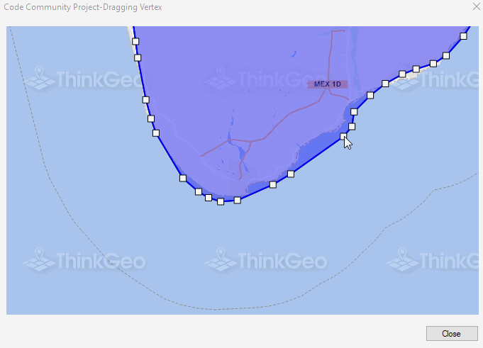

# Drag Vertex Sample for WinForms

### Description

The purpose of today’s project is not so much as show a new technology as to show an improvement in an existing one. We are already familiar with EditInteractiveOverlay with projects such as “Dragged PointStyle with Label”, “Snap To Layer” and “Snapping to Vertex”. But those projects showed EditInteractiveOverlay on small shapes. Using EditIntercticeOverlay on complex shapes became not very responsive. We improved that and now you can drag, resize, rotate and drag individual vertex of a complex polygon made of thousand of vertices with good responsiveness as you can see in this example.

Please refer to [Wiki](http://wiki.thinkgeo.com/wiki/map_suite_desktop_for_winforms) for the details.



### Requirements
This sample makes use of the following NuGet Packages

[MapSuite 10.0.0](https://www.nuget.org/packages?q=ThinkGeo)

### About the Code
```csharp
EditInteractiveOverlay editOverlay = winformsMap1.EditOverlay;
editOverlay.EditShapesLayer.Open();
editOverlay.EditShapesLayer.EditTools.BeginTransaction();
editOverlay.EditShapesLayer.InternalFeatures.Clear();
editOverlay.EditShapesLayer.EditTools.Add(features[0]);
TransactionResult result = editOverlay.EditShapesLayer.EditTools.CommitTransaction();
editOverlay.EditShapesLayer.BuildIndex();
editOverlay.EditShapesLayer.Close();
```
### Getting Help

[Map Suite Desktop for Winforms Wiki Resources](http://wiki.thinkgeo.com/wiki/map_suite_desktop_for_winforms)

[Map Suite Desktop for Winforms Product Description](https://thinkgeo.com/ui-controls#desktop-platforms)

[ThinkGeo Community Site](http://community.thinkgeo.com/)

[ThinkGeo Web Site](http://www.thinkgeo.com)

### Key APIs
This example makes use of the following APIs:

- [ThinkGeo.MapSuite.WinForms.EditInteractiveOverlay](http://wiki.thinkgeo.com/wiki/api/thinkgeo.mapsuite.winforms.editinteractiveoverlay)
- [ThinkGeo.MapSuite.Layers.TransactionResult](http://wiki.thinkgeo.com/wiki/api/thinkgeo.mapsuite.layers.transactionresult)

### About Map Suite
Map Suite is a set of powerful development components and services for the .Net Framework.

### About ThinkGeo
ThinkGeo is a GIS (Geographic Information Systems) company founded in 2004 and located in Frisco, TX. Our clients are in more than 40 industries including agriculture, energy, transportation, government, engineering, software development, and defense.
