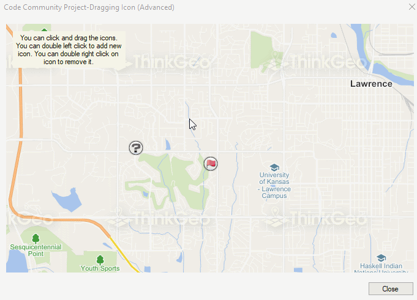

# Dragging Icon Advanced Sample for WinForms

### Description

This project is a more complete version of a previous project “Dragging Icon”. In addition to showing how to use EditInteractiveOverlay for dragging and dropping features represented by an icon, we also show how to add new features on the map by left double clicking on the map. You will also see how to remove a feature by right double clicking on its icon.

Please refer to [Wiki](http://wiki.thinkgeo.com/wiki/map_suite_desktop_for_winforms) for the details.



### Requirements
This sample makes use of the following NuGet Packages

[MapSuite 10.0.0](https://www.nuget.org/packages?q=ThinkGeo)

### About the Code
```csharp
EditInteractiveOverlay editInteractiveOverlay = new EditInteractiveOverlay();

editInteractiveOverlay.DragControlPointsLayer.ZoomLevelSet.ZoomLevel01.DefaultPointStyle.IsActive = false;
editInteractiveOverlay.DragControlPointsLayer.ZoomLevelSet.ZoomLevel01.ApplyUntilZoomLevel = ApplyUntilZoomLevel.Level20;

editInteractiveOverlay.EditShapesLayer.ZoomLevelSet.ZoomLevel01.DefaultPointStyle.IsActive = false;
editInteractiveOverlay.EditShapesLayer.ZoomLevelSet.ZoomLevel01.DefaultLineStyle.IsActive = false;
editInteractiveOverlay.EditShapesLayer.ZoomLevelSet.ZoomLevel01.DefaultAreaStyle.IsActive = false;

ValueStyle valueStyle = new ValueStyle();
valueStyle.ColumnName = "Type";

PointStyle carPointStyle = new PointStyle(new GeoImage(@"..\..\Data\locale.png"));
carPointStyle.PointType = PointType.Bitmap;
PointStyle busPointStyle = new PointStyle(new GeoImage(@"..\..\Data\unknown.png"));
busPointStyle.PointType = PointType.Bitmap;
```
### Getting Help

[Map Suite Desktop for Winforms Wiki Resources](http://wiki.thinkgeo.com/wiki/map_suite_desktop_for_winforms)

[Map Suite Desktop for Winforms Product Description](https://thinkgeo.com/ui-controls#desktop-platforms)

[ThinkGeo Community Site](http://community.thinkgeo.com/)

[ThinkGeo Web Site](http://www.thinkgeo.com)

### Key APIs
This example makes use of the following APIs:

- [ThinkGeo.MapSuite.WinForms.EditInteractiveOverlay](http://wiki.thinkgeo.com/wiki/api/thinkgeo.mapsuite.winforms.editinteractiveoverlay)
- [ThinkGeo.MapSuite.Styles.ValueStyle](http://wiki.thinkgeo.com/wiki/api/thinkgeo.mapsuite.styles.valuestyle)
- [ThinkGeo.MapSuite.Styles.PointStyle](http://wiki.thinkgeo.com/wiki/api/thinkgeo.mapsuite.styles.pointstyle)
- [ThinkGeo.MapSuite.Styles.PointType](http://wiki.thinkgeo.com/wiki/api/thinkgeo.mapsuite.styles.pointtype)

### About Map Suite
Map Suite is a set of powerful development components and services for the .Net Framework.

### About ThinkGeo
ThinkGeo is a GIS (Geographic Information Systems) company founded in 2004 and located in Frisco, TX. Our clients are in more than 40 industries including agriculture, energy, transportation, government, engineering, software development, and defense.
