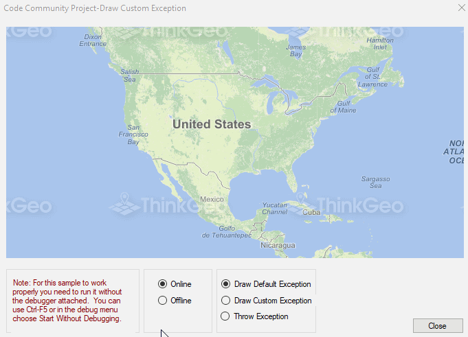

# Draw Custom Exception Sample for WinForms

### Description
This sample shows how you can suppress and draw exceptions in desktop overlays instead of throwing them. There is a little-known feature in the Map Suite Desktop Edition Overlay class that allows you to draw an exception in the event an exception is thrown during the drawing process. We have a default image we draw in this case; however, you can override this using the DrawExceptionCore method and draw whatever you want. By default we always throw expections, but to start drawing them you can use the Overlay.DrawExceptionMode property.

Please refer to [Wiki](http://wiki.thinkgeo.com/wiki/map_suite_desktop_for_winforms) for the details.



### Requirements
This sample makes use of the following NuGet Packages

[MapSuite 10.0.0](https://www.nuget.org/packages?q=ThinkGeo)

### About the Code
```csharp
protected override void DrawCore(GeoCanvas canvas)
{
    if (online)
    {
        base.DrawCore(canvas);
    }
    else
    {
        throw new Exception("Unable to connect to the ThinkGeo Cloud Map server.");
    }
}

protected override void DrawExceptionCore(GeoCanvas canvas, Exception e)
{
    if (drawCustomException)
    {
        // We are writing directly to the canvas.  Note that above we have access to the exception itself
        // and we could make the image based on that.
        canvas.DrawTextWithScreenCoordinate(e.Message, new GeoFont("Arial", 20), new GeoSolidBrush(new GeoColor(120, GeoColor.StandardColors.Red)), canvas.Width / 2, canvas.Height / 2, DrawingLevel.LevelOne);
    }
    else
    {
        base.DrawExceptionCore(canvas, e);
    }
}
```
### Getting Help

[Map Suite Desktop for Winforms Wiki Resources](http://wiki.thinkgeo.com/wiki/map_suite_desktop_for_winforms)

[Map Suite Desktop for Winforms Product Description](https://thinkgeo.com/ui-controls#desktop-platforms)

[ThinkGeo Community Site](http://community.thinkgeo.com/)

[ThinkGeo Web Site](http://www.thinkgeo.com)

### Key APIs
This example makes use of the following APIs:

- [ThinkGeo.MapSuite.Drawing.GeoCanvas](http://wiki.thinkgeo.com/wiki/api/thinkgeo.mapsuite.drawing.geocanvas)
- [ThinkGeo.MapSuite.Drawing.PlatformGeoCanvas](http://wiki.thinkgeo.com/wiki/api/thinkgeo.mapsuite.drawing.platformgeocanvas)

### About Map Suite
Map Suite is a set of powerful development components and services for the .Net Framework.

### About ThinkGeo
ThinkGeo is a GIS (Geographic Information Systems) company founded in 2004 and located in Frisco, TX. Our clients are in more than 40 industries including agriculture, energy, transportation, government, engineering, software development, and defense.
