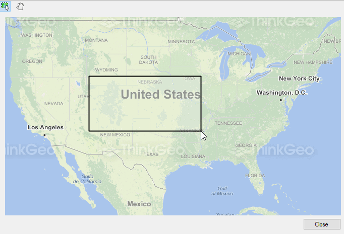

# Track Zoom In Without Shift Key Sample for WinForms

### Description

This project is for DesktopEdition users. In Map Suite 2.x, different modes of the map are offered to the developer to choose what kind of behavior the map has at a mouse action. In Map Suite 3.x, we went away from modes to have a more flexible model using InteracticeOverlay. By default, track zoom in is done by clicking and dragging the mouse on the map while holding the Shift key. This is very convenient but what if you want to offer the users the same experience as with 2.x, where the same mouse action has different behavior such as TrackZoomIn and Pan through the use of modes.

In this project, we show how to build your own InteractiveOverlay to emulate in Map Suite 3.x the mode behavior 2.x has.

Please refer to [Wiki](http://wiki.thinkgeo.com/wiki/map_suite_desktop_for_winforms) for the details.



### Requirements
This sample makes use of the following NuGet Packages

[MapSuite 10.0.0](https://www.nuget.org/packages?q=ThinkGeo)

### About the Code
```csharp
class ModeInteractiveOverlay: ExtentInteractiveOverlay
{
    protected override InteractiveResult MouseDownCore(InteractionArguments interactionArguments)
    {
        InteractiveResult result = null;
        result = base.MouseDownCore(interactionArguments);
        base.PanAndTrackZoomState.IsLeftClickDragKeyPressed = true;
        return result;
    }
}
```
### Getting Help

[Map Suite Desktop for Winforms Wiki Resources](http://wiki.thinkgeo.com/wiki/map_suite_desktop_for_winforms)

[Map Suite Desktop for Winforms Product Description](https://thinkgeo.com/ui-controls#desktop-platforms)

[ThinkGeo Community Site](http://community.thinkgeo.com/)

[ThinkGeo Web Site](http://www.thinkgeo.com)

### Key APIs
This example makes use of the following APIs:

- [ThinkGeo.MapSuite.WinForms.ExtentInteractiveOverlay](http://wiki.thinkgeo.com/wiki/api/thinkgeo.mapsuite.winforms.extentinteractiveoverlay)
- [ThinkGeo.MapSuite.WinForms.InteractionArguments](http://wiki.thinkgeo.com/wiki/api/thinkgeo.mapsuite.winforms.interactionarguments)
- [ThinkGeo.MapSuite.WinForms.InteractiveResult](http://wiki.thinkgeo.com/wiki/api/thinkgeo.mapsuite.winforms.interactiveresult)

### About Map Suite
Map Suite is a set of powerful development components and services for the .Net Framework.

### About ThinkGeo
ThinkGeo is a GIS (Geographic Information Systems) company founded in 2004 and located in Frisco, TX. Our clients are in more than 40 industries including agriculture, energy, transportation, government, engineering, software development, and defense.
