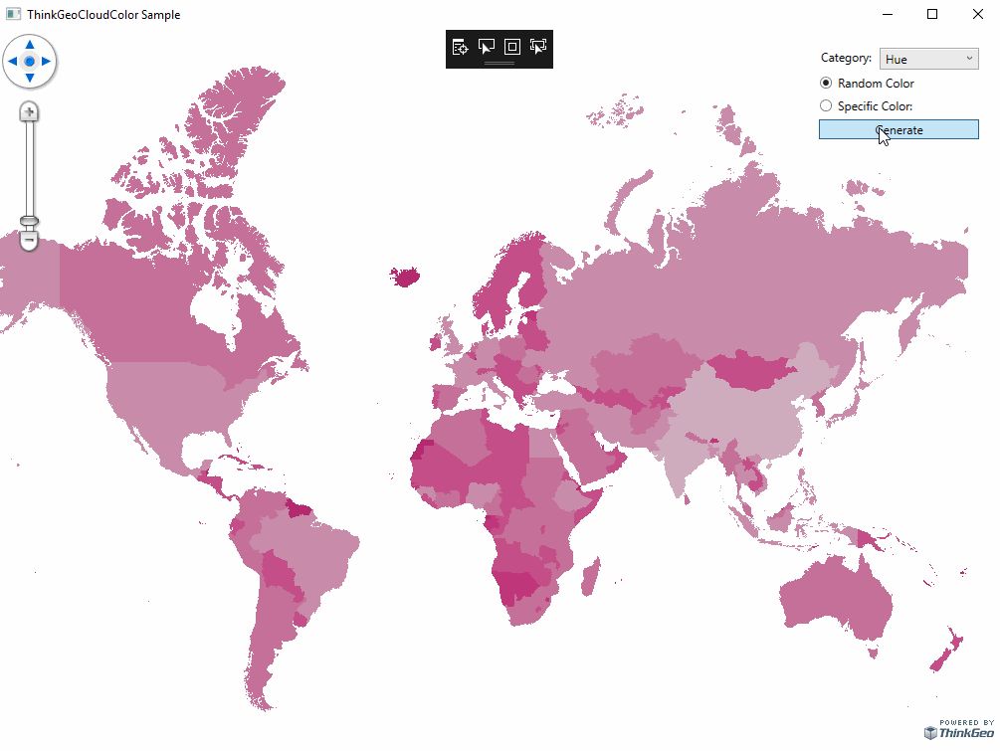

# ThinkGeo Cloud Color Sample for Wpf

### Description

This sample demonstrates how you can use ThinkGeo Cloud Client to get colors from ThinkGeo GIS Server. It supports 7 different colors:
- Hue
- Quality
- Analogous
- Complementary
- Contrasting
- Tetradic
- Triadic

ThinkGeo Cloud Client support would work in all of the Map Suite controls such as Wpf, Web, MVC, WebApi, Android and iOS.

Please refer to [Wiki](http://wiki.thinkgeo.com/wiki/map_suite_desktop_for_wpf) for the details.



### Requirements
This sample makes use of the following NuGet Packages

[MapSuite 10.0.0](https://www.nuget.org/packages?q=ThinkGeo)

### About the Code
```csharp
private void RefreshMap()
{
    Dictionary<GeoColor, Collection<GeoColor>> colorDictionary = new Dictionary<GeoColor, Collection<GeoColor>>();

    int numberOfColors = 20;
    bool isSpecifiedColor = rdoSpecificColor.IsChecked.Value;
    TryCovertToGeoColor(txtSpecificColor.Text, out var specifiedColor);
    switch (cboColorType.SelectionBoxItem.ToString())
    {
        case "Hue":
            var hueColors = isSpecifiedColor ? colorClient.GetColorsInHueFamily(specifiedColor, numberOfColors)
                : colorClient.GetColorsInHueFamily(numberOfColors);
            colorDictionary.Add(specifiedColor, hueColors);
            break;
        case "Analogous":
            colorDictionary = isSpecifiedColor ? colorClient.GetColorsInAnalogousFamily(specifiedColor, numberOfColors)
                : colorClient.GetColorsInAnalogousFamily(numberOfColors);
            break;
        case "Complementary":
            colorDictionary = isSpecifiedColor ? colorClient.GetColorsInComplementaryFamily(specifiedColor, numberOfColors)
                : colorClient.GetColorsInComplementaryFamily(numberOfColors);
            break;
        case "Contrasting":
            colorDictionary = isSpecifiedColor ? colorClient.GetColorsInContrastingFamily(specifiedColor, numberOfColors)
                : colorClient.GetColorsInContrastingFamily(numberOfColors);
            break;
        case "Quality":
            var qualityColors = isSpecifiedColor ? colorClient.GetColorsInQualityFamily(specifiedColor, numberOfColors)
                : colorClient.GetColorsInQualityFamily(numberOfColors);
            colorDictionary.Add(specifiedColor, qualityColors);
            break;
        case "Tetrad":
            colorDictionary = isSpecifiedColor ? colorClient.GetColorsInTetradFamily(specifiedColor, numberOfColors)
                : colorClient.GetColorsInTetradFamily(numberOfColors);
            break;
        case "Triad":
            colorDictionary = isSpecifiedColor ? colorClient.GetColorsInTriadFamily(specifiedColor, numberOfColors)
                : colorClient.GetColorsInTriadFamily(numberOfColors);
            break;
    }

    List<GeoColor> allColors = new List<GeoColor>();
    foreach (var colors in colorDictionary.Values)
        allColors.AddRange(colors);

    ShapeFileFeatureLayer layer = (ShapeFileFeatureLayer)(layerOverlay.Layers["Population"]);
    layer.ZoomLevelSet.ZoomLevel01.CustomStyles.Clear();

    ClassBreakStyle classBreakStyle = new ClassBreakStyle();
    classBreakStyle.ColumnName = "pop_cntry";
    double population = 50000;
    foreach (var color in allColors)
    {
        AreaStyle areaStyle = new AreaStyle(new GeoSolidBrush(color));
        population *= 2;
        classBreakStyle.ClassBreaks.Add(new ClassBreak(population, areaStyle));
    }
    layer.ZoomLevelSet.ZoomLevel01.CustomStyles.Add(classBreakStyle);
    layer.ZoomLevelSet.ZoomLevel01.ApplyUntilZoomLevel = ApplyUntilZoomLevel.Level20;

    map.Refresh(layerOverlay);
}

```
### Getting Help

[Map Suite Desktop for Wpf Wiki Resources](http://wiki.thinkgeo.com/wiki/map_suite_desktop_for_Wpf)

[Map Suite Desktop for Wpf Product Description](https://thinkgeo.com/ui-controls#wpf-platforms)

[ThinkGeo Community Site](http://community.thinkgeo.com/)

[ThinkGeo Web Site](http://www.thinkgeo.com)

### Key APIs
This example makes use of the following APIs:

Working...


### About Map Suite
Map Suite is a set of powerful development components and services for the .Net Framework.

### About ThinkGeo
ThinkGeo is a GIS (Geographic Information Systems) company founded in 2004 and located in Frisco, TX. Our clients are in more than 40 industries including agriculture, energy, transportation, government, engineering, software development, and defense.
