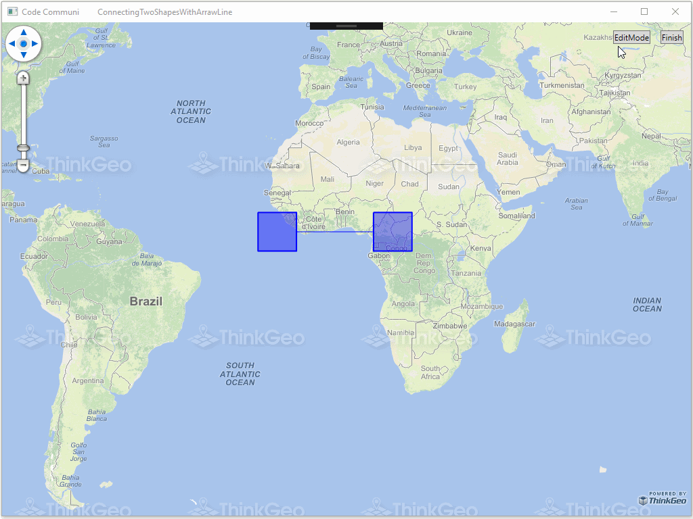

# Connecting Two Shapes With Arraw Line Sample for Wpf

### Description

In this sample, two polygons are connected by a arrowline, and if the polygons are moved the connecting arrowline will be moved automatically as well.

Please refer to [Wiki](http://wiki.thinkgeo.com/wiki/map_suite_desktop_for_wpf) for the details.



### Requirements
This sample makes use of the following NuGet Packages

[MapSuite 10.0.0](https://www.nuget.org/packages?q=ThinkGeo)

### About the Code
```csharp
class MyLineStyle : LineStyle
{
    protected override void DrawCore(IEnumerable<Feature> features, GeoCanvas canvas, Collection<SimpleCandidate> labelsInThisLayer, Collection<SimpleCandidate> labelsInAllLayers)
    {
        foreach (Feature feature in features)
        {
            LineShape line = (LineShape)feature.GetShape();

            double X1 = line.Vertices[0].X;
            double Y1 = line.Vertices[0].Y;
            double X2 = line.Vertices[1].X;
            double Y2 = line.Vertices[1].Y;

            double angle = Math.Atan((Y2 - Y1) / (X2 - X1));
            double openingAngle = Math.PI / 8;
            double radius = 2;

            canvas.DrawLine(feature, OuterPen, DrawingLevel.LevelOne);

            LineShape oLineShape = new LineShape();
            oLineShape.Vertices.Add(new Vertex(X2 + radius * Math.Cos(Math.PI + angle - openingAngle), Y2 + radius * Math.Sin(Math.PI + angle - openingAngle)));
            oLineShape.Vertices.Add(new Vertex(X2, Y2));
            oLineShape.Vertices.Add(new Vertex(X2 + radius * Math.Cos(Math.PI + angle + openingAngle), Y2 + radius * Math.Sin(Math.PI + angle + openingAngle)));
            canvas.DrawLine(oLineShape, OuterPen, DrawingLevel.LevelOne);
        }
    }
}
```
### Getting Help

[Map Suite Desktop for Wpf Wiki Resources](http://wiki.thinkgeo.com/wiki/map_suite_desktop_for_wpf)

[Map Suite Desktop for Wpf Product Description](https://thinkgeo.com/ui-controls#desktop-platforms)

[ThinkGeo Community Site](http://community.thinkgeo.com/)

[ThinkGeo Web Site](http://www.thinkgeo.com)

### Key APIs
This example makes use of the following APIs:

- [ThinkGeo.MapSuite.Shapes.Feature](http://wiki.thinkgeo.com/wiki/api/thinkgeo.mapsuite.shapes.feature)
- [ThinkGeo.MapSuite.Drawing.GeoCanvas](http://wiki.thinkgeo.com/wiki/api/thinkgeo.mapsuite.drawing.geocanvas)
- [ThinkGeo.MapSuite.Styles.SimpleCandidate](http://wiki.thinkgeo.com/wiki/api/thinkgeo.mapsuite.styles.simplecandidate)
- [ThinkGeo.MapSuite.Shapes.LineShape](http://wiki.thinkgeo.com/wiki/api/thinkgeo.mapsuite.shapes.lineshape)
- [ThinkGeo.MapSuite.Shapes.Vertex](http://wiki.thinkgeo.com/wiki/api/thinkgeo.mapsuite.shapes.vertex)

### About Map Suite
Map Suite is a set of powerful development components and services for the .Net Framework.

### About ThinkGeo
ThinkGeo is a GIS (Geographic Information Systems) company founded in 2004 and located in Frisco, TX. Our clients are in more than 40 industries including agriculture, energy, transportation, government, engineering, software development, and defense.
