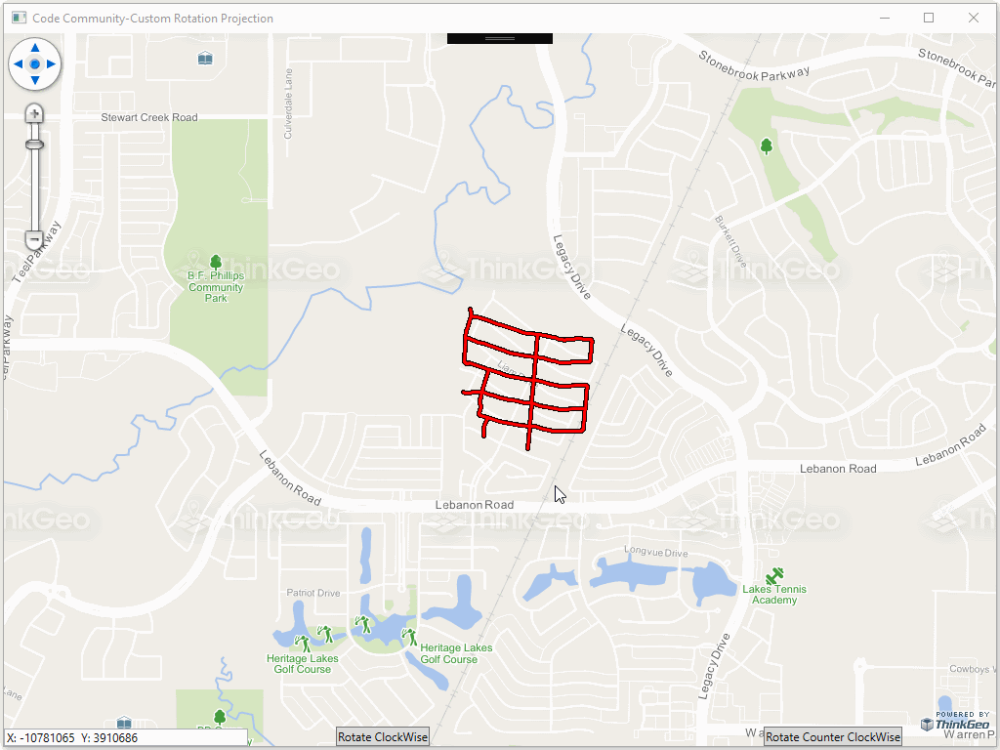

# Custom Rotation Projection Sample for Wpf

### Description
In today’s project, we show how to create your own projection class that allows projecting a layer from any internal projection to any external while doing a rotation at the same time. Having the capability to apply those two operations in one step may come handy if the original layer was created in a different projection with the north at an angle and you want to align it on the base map.

Please refer to [Wiki](http://wiki.thinkgeo.com/wiki/map_suite_desktop_for_wpf) for the details.



### Requirements
This sample makes use of the following NuGet Packages

[MapSuite 10.0.0](https://www.nuget.org/packages?q=ThinkGeo)

### About the Code
```csharp
class CustomRotationProjection : Projection, IDisposable
{
    protected override Vertex[] ConvertToExternalProjectionCore(double[] x, double[] y)
    {
        //First, converts to the external projection
        Vertex[] projVertices = new Vertex[x.Length];
        proj4.Open();
        for (int i = 0; i < projVertices.Length; i++)
        {
            projVertices[i] = proj4.ConvertToExternalProjection(x[i], y[i]);
        }
        proj4.Close();

        Vertex[] rotateVertices = new Vertex[x.Length];

        //Second, rotates based on angle and pivot point.
        for (int i = 0; i < rotateVertices.Length; i++)
        {
            rotateVertices[i] = RotateVertex(projVertices[i].X, projVertices[i].Y, angle);
        }

        return rotateVertices;
    }
}
```
### Getting Help

[Map Suite Desktop for Wpf Wiki Resources](http://wiki.thinkgeo.com/wiki/map_suite_desktop_for_wpf)

[Map Suite Desktop for Wpf Product Description](https://thinkgeo.com/ui-controls#desktop-platforms)

[ThinkGeo Community Site](http://community.thinkgeo.com/)

[ThinkGeo Web Site](http://www.thinkgeo.com)

### Key APIs
This example makes use of the following APIs:

- [ThinkGeo.MapSuite.Shapes.Projection](http://wiki.thinkgeo.com/wiki/api/thinkgeo.mapsuite.shapes.projection)
- [ThinkGeo.MapSuite.Shapes.Vertex](http://wiki.thinkgeo.com/wiki/api/thinkgeo.mapsuite.shapes.vertex)

### About Map Suite
Map Suite is a set of powerful development components and services for the .Net Framework.

### About ThinkGeo
ThinkGeo is a GIS (Geographic Information Systems) company founded in 2004 and located in Frisco, TX. Our clients are in more than 40 industries including agriculture, energy, transportation, government, engineering, software development, and defense.
