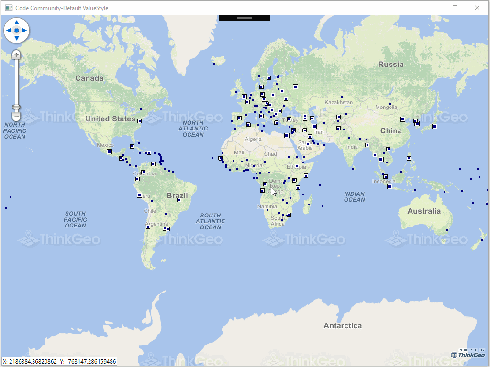

# Default Value Style Sample for Wpf

### Description

In today’s Wpf project, we demonstrate the extensibility of ThinkGeo API by creating a custom Style. Inheriting from **ValueStyle**, we create a Default Value Style that handles the drawing of features that don’t have a value defined in the **ValueStyle**. Here we are using a point based layer with **PointStyle**. Note that the Default **ValueStyle** would also work with line and polygon based layers.

Please refer to [Wiki](http://wiki.thinkgeo.com/wiki/map_suite_desktop_for_wpf) for the details.



### Requirements

This sample makes use of the following NuGet Packages

[MapSuite 10.0.0](https://www.nuget.org/packages?q=ThinkGeo)

### About the Code
```csharp
class CustomDefaultValueStyle : ValueStyle
{
    protected override void DrawCore(System.Collections.Generic.IEnumerable<Feature> features, GeoCanvas canvas, System.Collections.ObjectModel.Collection<SimpleCandidate> labelsInThisLayer, System.Collections.ObjectModel.Collection<SimpleCandidate> labelsInAllLayers)
    {
        foreach (Feature feature in features)
        {
            string fieldValue = feature.ColumnValues[this.ColumnName].Trim();
            ValueItem valueItem = GetValueItem(fieldValue);

            Feature[] tmpFeatures = new Feature[1] { feature };
            if (valueItem.CustomStyles.Count == 0)
            {
                if (!string.IsNullOrEmpty(valueItem.Value))
                {
                    valueItem.DefaultAreaStyle.Draw(tmpFeatures, canvas, labelsInThisLayer, labelsInAllLayers);
                    valueItem.DefaultLineStyle.Draw(tmpFeatures, canvas, labelsInThisLayer, labelsInAllLayers);
                    valueItem.DefaultPointStyle.Draw(tmpFeatures, canvas, labelsInThisLayer, labelsInAllLayers);
                }
                else
                {
                    defaultStyle.Draw(tmpFeatures, canvas, labelsInThisLayer, labelsInAllLayers);
                }
                valueItem.DefaultTextStyle.Draw(tmpFeatures, canvas, labelsInThisLayer, labelsInAllLayers);
            }
            else
            {
                foreach (Style style in valueItem.CustomStyles)
                {
                    style.Draw(tmpFeatures, canvas, labelsInThisLayer, labelsInAllLayers);
                }
            }
        }
    }
}
```
### Getting Help

[Map Suite Desktop for Wpf Wiki Resources](http://wiki.thinkgeo.com/wiki/map_suite_desktop_for_wpf)

[Map Suite Desktop for Wpf Product Description](https://thinkgeo.com/ui-controls#desktop-platforms)

[ThinkGeo Community Site](http://community.thinkgeo.com/)

[ThinkGeo Web Site](http://www.thinkgeo.com)

### Key APIs
This example makes use of the following APIs:

- [ThinkGeo.MapSuite.Styles.ValueStyle](http://wiki.thinkgeo.com/wiki/api/thinkgeo.mapsuite.styles.valuestyle)
- [ThinkGeo.MapSuite.Shapes.Feature](http://wiki.thinkgeo.com/wiki/api/thinkgeo.mapsuite.shapes.feature)
- [ThinkGeo.MapSuite.Styles.ValueItem](http://wiki.thinkgeo.com/wiki/api/thinkgeo.mapsuite.styles.valueitem)
- [ThinkGeo.MapSuite.Drawing.GeoCanvas](http://wiki.thinkgeo.com/wiki/api/thinkgeo.mapsuite.drawing.geocanvas)
- [ThinkGeo.MapSuite.Styles.TextStyle](http://wiki.thinkgeo.com/wiki/api/thinkgeo.mapsuite.styles.textstyle)

### About Map Suite
Map Suite is a set of powerful development components and services for the .Net Framework.

### About ThinkGeo
ThinkGeo is a GIS (Geographic Information Systems) company founded in 2004 and located in Frisco, TX. Our clients are in more than 40 industries including agriculture, energy, transportation, government, engineering, software development, and defense.
