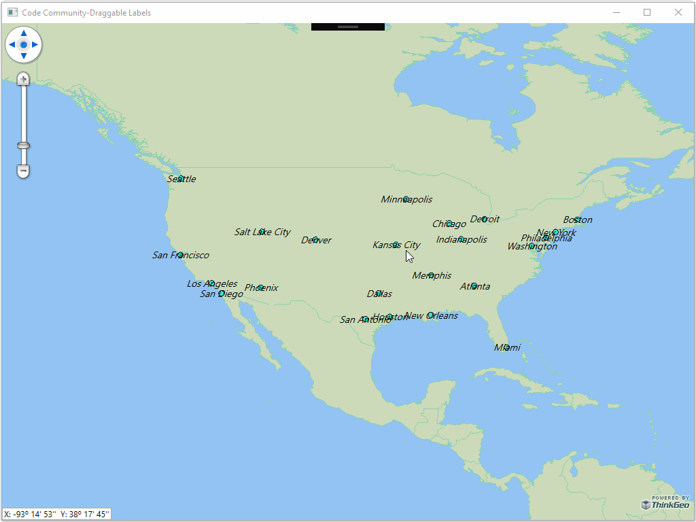

# Draggable Labels Sample for Wpf

### Description

In this WPF project, you will learn how to place labels from a shapefile into a **SimpleMarkerOverlay**. Using the **DragMode** property of the **SimpleMarkerOverlay**, the user can then drag the labels to place them at the desired location for the most pleasing labeling effect. This project will be later completed to show how to save the state of the dragged labels from the **SimpleMarkerOverlay** and reload them.

Please refer to [Wiki](http://wiki.thinkgeo.com/wiki/map_suite_desktop_for_wpf) for the details.



### Requirements
This sample makes use of the following NuGet Packages

[MapSuite 10.0.0](https://www.nuget.org/packages?q=ThinkGeo)

### About the Code
```csharp
ShapeFileFeatureLayer shapeFileFeatureLayer2 = new ShapeFileFeatureLayer(@"..\..\Data\MajorCities.shp");
shapeFileFeatureLayer2.ZoomLevelSet.ZoomLevel01.DefaultPointStyle = PointStyles.CreateSimpleCircleStyle(GeoColor.StandardColors.Turquoise, 8, GeoColor.StandardColors.Black);
shapeFileFeatureLayer2.ZoomLevelSet.ZoomLevel01.ApplyUntilZoomLevel = ApplyUntilZoomLevel.Level20;

LayerOverlay layerOverlay = new LayerOverlay();
layerOverlay.Layers.Add(shapeFileFeatureLayer1);
layerOverlay.Layers.Add(shapeFileFeatureLayer2);
wpfMap1.Overlays.Add(layerOverlay);

SimpleMarkerOverlay simpleMarkerOverlay = new SimpleMarkerOverlay();
simpleMarkerOverlay.DragMode = MarkerDragMode.Drag;
```
### Getting Help

[Map Suite Desktop for Wpf Wiki Resources](http://wiki.thinkgeo.com/wiki/map_suite_desktop_for_wpf)

[Map Suite Desktop for Wpf Product Description](https://thinkgeo.com/ui-controls#desktop-platforms)

[ThinkGeo Community Site](http://community.thinkgeo.com/)

[ThinkGeo Web Site](http://www.thinkgeo.com)

### Key APIs
This example makes use of the following APIs:

- [ThinkGeo.MapSuite.Layers.ShapeFileFeatureLayer](http://wiki.thinkgeo.com/wiki/api/thinkgeo.mapsuite.layers.shapefilefeaturelayer)
- [ThinkGeo.MapSuite.Styles.PointStyles](http://wiki.thinkgeo.com/wiki/api/thinkgeo.mapsuite.styles.pointstyles)
- [ThinkGeo.MapSuite.Drawing.GeoColor](http://wiki.thinkgeo.com/wiki/api/thinkgeo.mapsuite.drawing.geocolor)
- [ThinkGeo.MapSuite.Layers.ApplyUntilZoomLevel](http://wiki.thinkgeo.com/wiki/api/thinkgeo.mapsuite.layers.applyuntilzoomlevel)
- [ThinkGeo.MapSuite.Wpf.LayerOverlay](http://wiki.thinkgeo.com/wiki/api/thinkgeo.mapsuite.wpf.layeroverlay)
- [ThinkGeo.MapSuite.Wpf.SimpleMarkerOverlay](http://wiki.thinkgeo.com/wiki/api/thinkgeo.mapsuite.wpf.simplemarkeroverlay)

### About Map Suite
Map Suite is a set of powerful development components and services for the .Net Framework.

### About ThinkGeo
ThinkGeo is a GIS (Geographic Information Systems) company founded in 2004 and located in Frisco, TX. Our clients are in more than 40 industries including agriculture, energy, transportation, government, engineering, software development, and defense.
