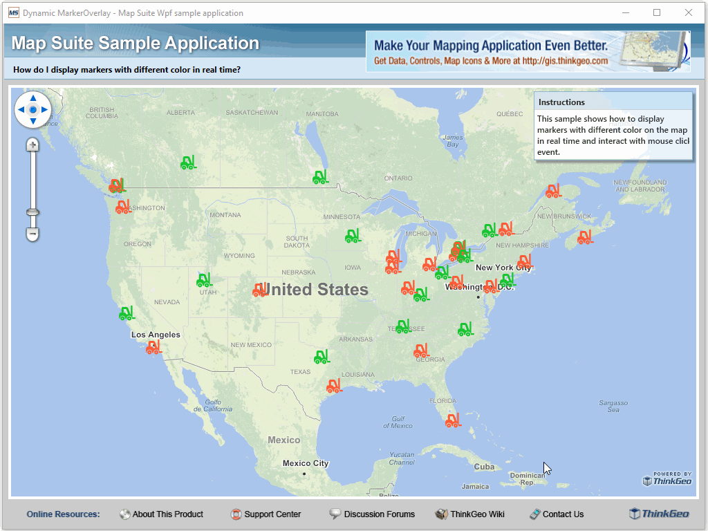

# Dynamic Marker Overlay Sample for Wpf

### Description
In today’s WPF project, we show you how to retrieve data from a REST service and display them as markers with different styles based on its attributes. You can click on any marker to call a WCF service which returns data from the server. A popup displays a chart with information. All the markers and related information are updated dynamically after a specific time interval.

Please refer to [Wiki](http://wiki.thinkgeo.com/wiki/map_suite_desktop_for_wpf) for the details.



### Requirements
This sample makes use of the following NuGet Packages

[MapSuite 10.0.0](https://www.nuget.org/packages?q=ThinkGeo)

### About the Code
```csharp
Marker marker = sender as Marker;

FeatureSourceMarkerOverlay facilitiesOverlay = Map1.Overlays["FacilitiesOverlay"] as FeatureSourceMarkerOverlay;
facilitiesOverlay.FeatureSource.Open();
Collection<Feature> selectedFeatures = facilitiesOverlay.FeatureSource.GetFeaturesNearestTo(new PointShape(marker.Position.X, marker.Position.Y), Map1.MapUnit, 1, ReturningColumnsType.AllColumns);
facilitiesOverlay.FeatureSource.Close();

if (selectedFeatures.Count > 0)
{
    PopupOverlay popupOverlay = (PopupOverlay)Map1.Overlays["MessagePopup"];
    Popup popup = new Popup(marker.Position);
    Feature feature = selectedFeatures[0];
    popup.Content = CreatePopup(selectedFeatures[0]);
    popup.FontSize = 12d;

    popupOverlay.Popups.Clear();
    popupOverlay.Popups.Add(popup);
    popupOverlay.Refresh();
}
```
### Getting Help

[Map Suite Desktop for Wpf Wiki Resources](http://wiki.thinkgeo.com/wiki/map_suite_desktop_for_wpf)

[Map Suite Desktop for Wpf Product Description](https://thinkgeo.com/ui-controls#desktop-platforms)

[ThinkGeo Community Site](http://community.thinkgeo.com/)

[ThinkGeo Web Site](http://www.thinkgeo.com)

### Key APIs
This example makes use of the following APIs:

- [ThinkGeo.MapSuite.Wpf.Marker](http://wiki.thinkgeo.com/wiki/api/thinkgeo.mapsuite.wpf.marker)
- [ThinkGeo.MapSuite.Wpf.FeatureSourceMarkerOverlay](http://wiki.thinkgeo.com/wiki/api/thinkgeo.mapsuite.wpf.featuresourcemarkeroverlay)
- [ThinkGeo.MapSuite.Wpf.PopupOverlay](http://wiki.thinkgeo.com/wiki/api/thinkgeo.mapsuite.wpf.popupoverlay)
- [ThinkGeo.MapSuite.Wpf.Popup](http://wiki.thinkgeo.com/wiki/api/thinkgeo.mapsuite.wpf.popup)
- [ThinkGeo.MapSuite.Shapes.Feature](http://wiki.thinkgeo.com/wiki/api/thinkgeo.mapsuite.shapes.feature)

### About Map Suite
Map Suite is a set of powerful development components and services for the .Net Framework.

### About ThinkGeo
ThinkGeo is a GIS (Geographic Information Systems) company founded in 2004 and located in Frisco, TX. Our clients are in more than 40 industries including agriculture, energy, transportation, government, engineering, software development, and defense.
