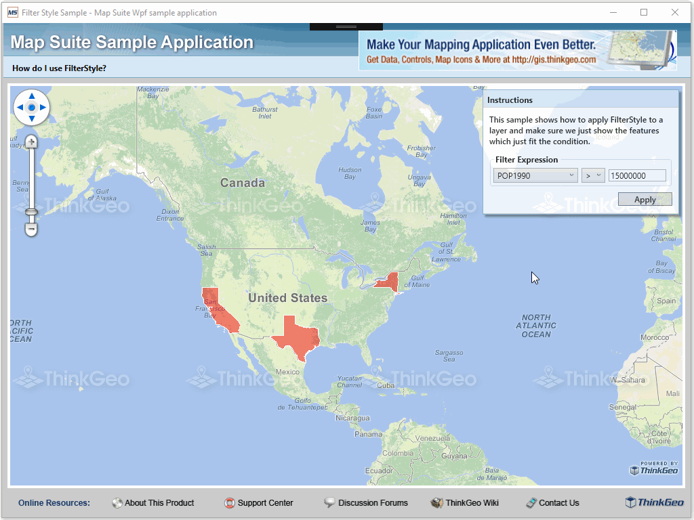

# Filter Style Sample for Wpf

### Description

This project outlines how to apply the FilterStyle to a layer's display. By using this style, the map will filter the features queried from the source file by checking if a specified column value fits the input condition. This effect can be applied to all the Map Suite products.

Please refer to [Wiki](http://wiki.thinkgeo.com/wiki/map_suite_desktop_for_wpf) for the details.



### Requirements

This sample makes use of the following NuGet Packages

[MapSuite 10.0.0](https://www.nuget.org/packages?q=ThinkGeo)

### About the Code
```csharp
filterStyle = new FilterStyle();
filterStyle.Conditions.Add(CreateNewFilterCondition());
filterStyle.Styles.Add(AreaStyles.CreateSimpleAreaStyle(GeoColor.FromArgb(120, GeoColor.StandardColors.Red), GeoColor.SimpleColors.White));
```
### Getting Help

[Map Suite Desktop for Wpf Wiki Resources](http://wiki.thinkgeo.com/wiki/map_suite_desktop_for_wpf)

[Map Suite Desktop for Wpf Product Description](https://thinkgeo.com/ui-controls#desktop-platforms)

[ThinkGeo Community Site](http://community.thinkgeo.com/)

[ThinkGeo Web Site](http://www.thinkgeo.com)

### Key APIs
This example makes use of the following APIs:

- [ThinkGeo.MapSuite.Styles.FilterStyle](http://wiki.thinkgeo.com/wiki/api/thinkgeo.mapsuite.styles.filterstyle)
- [ThinkGeo.MapSuite.Styles.AreaStyles](http://wiki.thinkgeo.com/wiki/api/thinkgeo.mapsuite.styles.areastyles)
- [ThinkGeo.MapSuite.Drawing.GeoColor](http://wiki.thinkgeo.com/wiki/api/thinkgeo.mapsuite.drawing.geocolor)

### About Map Suite
Map Suite is a set of powerful development components and services for the .Net Framework.

### About ThinkGeo
ThinkGeo is a GIS (Geographic Information Systems) company founded in 2004 and located in Frisco, TX. Our clients are in more than 40 industries including agriculture, energy, transportation, government, engineering, software development, and defense.
