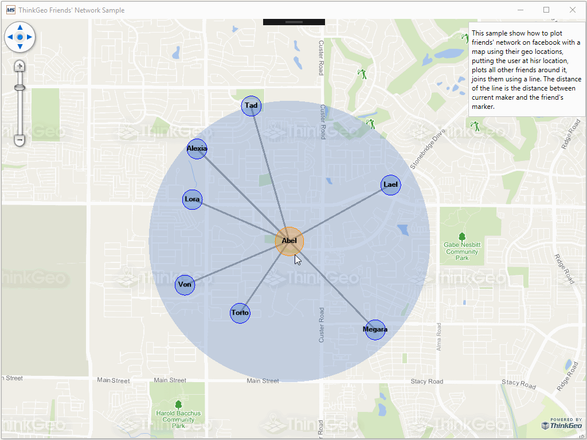

# Friends Network Sample for Wpf

### Description

In this WPF project we show how you can create a friends network using a point with a circle symbol. It’s a combination of PointStyle and TextStyle, including a description with a mask that keeps the labels in the same layer. It was originally required by a customer at [http://community.thinkgeo.com/t/label-on-a-circle-with-lot-of-points/8193/6](http://community.thinkgeo.com/t/label-on-a-circle-with-lot-of-points/8193/6), it’s a solution with many applications.

Please refer to [Wiki](http://wiki.thinkgeo.com/wiki/map_suite_desktop_for_wpf) for the details.



### Requirements
This sample makes use of the following NuGet Packages

[MapSuite 10.0.0](https://www.nuget.org/packages?q=ThinkGeo)

### About the Code
```csharp
PointStyle friendsPointStyle = new PointStyle(PointSymbolType.Circle, new GeoSolidBrush(new GeoColor(80, GeoColors.Highlight)), new GeoPen(GeoColors.Blue, 1), symbolSize - 15);
PointStyle protagonistPointStyle = new PointStyle(PointSymbolType.Circle, new GeoSolidBrush(new GeoColor(80, GeoColors.DarkOrange)), new GeoPen(GeoColors.DarkOrange, 1), symbolSize);

ValueStyle pointValueStyle = new ValueStyle();
pointValueStyle.ColumnName = "role";
pointValueStyle.ValueItems.Add(new ValueItem("friend", friendsPointStyle));
pointValueStyle.ValueItems.Add(new ValueItem("protagonist", protagonistPointStyle));

TextStyle friendsTexStyle = new TextStyle("Name", new GeoFont("Arail", 9, DrawingFontStyles.Bold), new GeoSolidBrush(GeoColor.SimpleColors.Black));
friendsTexStyle.PointPlacement = PointPlacement.Center;
friendsTexStyle.OverlappingRule = LabelOverlappingRule.AllowOverlapping;
```
### Getting Help

[Map Suite Desktop for Wpf Wiki Resources](http://wiki.thinkgeo.com/wiki/map_suite_desktop_for_wpf)

[Map Suite Desktop for Wpf Product Description](https://thinkgeo.com/ui-controls#desktop-platforms)

[ThinkGeo Community Site](http://community.thinkgeo.com/)

[ThinkGeo Web Site](http://www.thinkgeo.com)

### Key APIs
This example makes use of the following APIs:

- [ThinkGeo.MapSuite.Styles.PointStyle](http://wiki.thinkgeo.com/wiki/api/thinkgeo.mapsuite.styles.pointstyle)
- [ThinkGeo.MapSuite.Styles.PointSymbolType](http://wiki.thinkgeo.com/wiki/api/thinkgeo.mapsuite.styles.pointsymboltype)
- [ThinkGeo.MapSuite.Drawing.GeoSolidBrush](http://wiki.thinkgeo.com/wiki/api/thinkgeo.mapsuite.drawing.geosolidbrush)
- [ThinkGeo.MapSuite.Drawing.GeoColors](http://wiki.thinkgeo.com/wiki/api/thinkgeo.mapsuite.drawing.geocolors)
- [ThinkGeo.MapSuite.Drawing.GeoPen](http://wiki.thinkgeo.com/wiki/api/thinkgeo.mapsuite.drawing.geopen)
- [ThinkGeo.MapSuite.Styles.ValueStyle](http://wiki.thinkgeo.com/wiki/api/thinkgeo.mapsuite.styles.valuestyle)
- [ThinkGeo.MapSuite.Styles.ValueItem](http://wiki.thinkgeo.com/wiki/api/thinkgeo.mapsuite.styles.valueitem)
- [ThinkGeo.MapSuite.Styles.TextStyle](http://wiki.thinkgeo.com/wiki/api/thinkgeo.mapsuite.styles.textstyle)
- [ThinkGeo.MapSuite.Drawing.GeoFont](http://wiki.thinkgeo.com/wiki/api/thinkgeo.mapsuite.drawing.geofont)
- [ThinkGeo.MapSuite.Drawing.DrawingFontStyles](http://wiki.thinkgeo.com/wiki/api/thinkgeo.mapsuite.drawing.drawingfontstyles)
- [ThinkGeo.MapSuite.Styles.PointPlacement](http://wiki.thinkgeo.com/wiki/api/thinkgeo.mapsuite.styles.pointplacement)
- [ThinkGeo.MapSuite.Styles.LabelOverlappingRule](http://wiki.thinkgeo.com/wiki/api/thinkgeo.mapsuite.styles.labeloverlappingrule)

### About Map Suite
Map Suite is a set of powerful development components and services for the .Net Framework.

### About ThinkGeo
ThinkGeo is a GIS (Geographic Information Systems) company founded in 2004 and located in Frisco, TX. Our clients are in more than 40 industries including agriculture, energy, transportation, government, engineering, software development, and defense.
