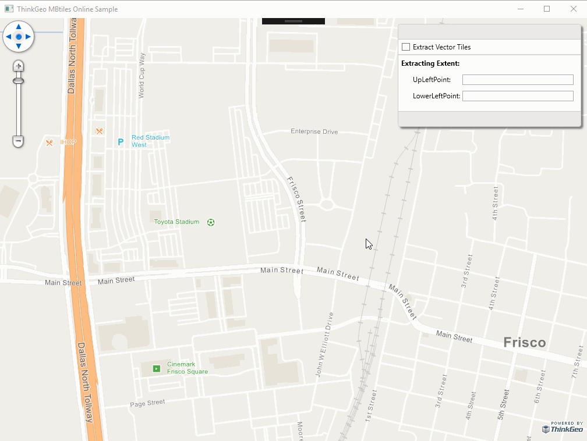

# MBTiles Extractor Sample for WPF

### Description

The MBTiles Extractor allows you to create new smaller subsets from the MBTiles database. You simply specify the bounding box by tracking a rectangle shape on the map for the new area, then it will create a new SQLite database for that regions.

*.MBTile format can be supported in all of the Map Suite controls such as Wpf, Web, MVC, WebApi, Android and iOS.

Please refer to [Wiki](https://wiki.thinkgeo.com/wiki/map_suite_desktop_for_wpf) for the details.



### Requirements
This sample makes use of the following NuGet Packages

[MapSuite 10.5.0](https://www.nuget.org/packages?q=ThinkGeo)

### About the Code
```csharp
MbtilesDatabase.CreateFileDatabase(targetFilePath);
MbtilesDatabase targetDB = MbtilesDatabase.OpenDatabase(targetFilePath);

MbtilesDatabase sourceDB = MbtilesDatabase.OpenDatabase("Data/tiles_Frisco.mbtiles");
sourceDB.Metadata.NextPage();
foreach (MetadataEntry entry in sourceDB.Metadata.Entries)
{
    if (entry.Name.Equals("center"))
    {
        PointShape centerPoint = projection.ConvertToExternalProjection(bbox).GetCenterPoint();
        entry.Value = $"{centerPoint.X},{centerPoint.Y},{maxZoom}";
    }
}
targetDB.Metadata.Insert(sourceDB.Metadata.Entries);

foreach (var tileRange in tileRanges)
{
    long offset = 0;
    bool isEnd = false;
    while (!isEnd)
    {
        string querySql = $"SELECT * FROM {sourceDB.Map.TableName} WHERE " + ConvetToSqlString(tileRange) + $" LIMI {offset},{offset + 1000}";
        var entries = sourceDB.Map.Query(querySql);
        targetDB.Map.Insert(entries);

        querySql = $"SELECT images.tile_data as tile_data, images.tile_id as tile_id FROM{sourceDB.Images.TableName} WHERE images.tile_id IN ( SELECT {Map.TileIdColumnName} FROM{sourceDB.Map.TableName} WHERE " + ConvetToSqlString(tileRange) + ")";
        entries = sourceDB.Images.Query(querySql);
        targetDB.Images.Insert(entries);

        if (entries.Count < 1000)
            isEnd = true;
        offset = offset + 1000;
    }
}
```
### Getting Help

[Map Suite UI Control for WPF Wiki Resources](https://wiki.thinkgeo.com/wiki/map_suite_desktop_for_wpf)

[Map Suite UI Control for WPF Product Description](https://thinkgeo.com/gis-ui-desktop#platforms)

[ThinkGeo Community Site](http://community.thinkgeo.com/)

[ThinkGeo Web Site](http://www.thinkgeo.com)

### Key APIs
This example makes use of the following APIs:

Working...


### About Map Suite
Map Suite is a set of powerful development components and services for the .Net Framework.

### About ThinkGeo
ThinkGeo is a GIS (Geographic Information Systems) company founded in 2004 and located in Frisco, TX. Our clients are in more than 40 industries including agriculture, energy, transportation, government, engineering, software development, and defense.
