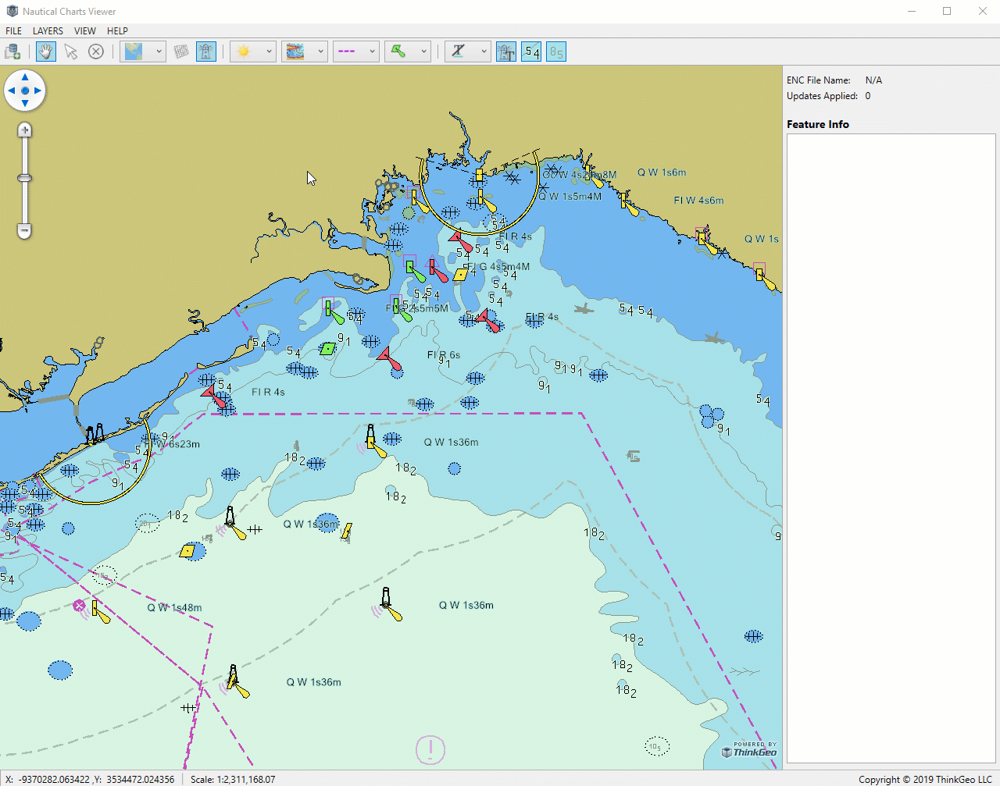

# Nautical Charts Viewer Sample for Wpf

### Description
ThinkGeo Nautical Charts is a standalone Nuget Package which works with ThinkGeo 10.X Desktop/Web products. It reads and displays S-57 Electronic Navigational Charts(ENC) from International Hydrographic Organization(IHO), it also reads the style info defined in an S-52 file.

This sample happens to be written for WPF but the Nautical Charts Package works for Web project as well. Download and open it in Visual Studio, hit F5 and Bang, you are good to go. After you have the charts viewer running, use File -> Open to load an S-57 data, (it can be downloaded from NOAA’s website), the nautical charts will then appear on the map (it generates an index file the first time the data is loaded).

ThinkGeo uses a default style which can be easily modified. Nautical Charts Viewer provide the ability to switch the map between 5 modes: Day Bright, Day Black, Day White, Dusk and Night. It has 3 verbose mode of “All”, “Standard” and “Base”. It can switch boundaries between dashed line and triangles, it can show/hide different labeling, show different languages, etc. If you are a developer, dig in the code and you can see it’s as simple as creating a layer and set up the properties like following, and it can do more than it shows in this sample



### Requirements
This sample makes use of the following NuGet Packages

[MapSuite 10.0.0](https://www.nuget.org/packages/ThinkGeo.MapSuite)

### About the Code
```csharp
// Please input your ThinkGeo Cloud ID/Secret to enable the background map.
ThinkGeoCloudRasterMapsOverlay baseOverlay = new ThinkGeoCloudRasterMapsOverlay("ThinkGeo Cloud clientId", "ThinkGeo Cloud clientSecret");

// Set up the Nautical Charts Feature Layer
NauticalChartsFeatureLayer nauticalChartsFeatureLayer = new NauticalChartsFeatureLayer("Nautical Charts Pathfile Name");

layer.IsDepthContourTextVisible = true;
layer.IsLightDescriptionVisible = true;
layer.IsSoundingTextVisible = true;
layer.SymbolTextDisplayMode = NauticalChartsSymbolTextDisplayMode.English;
layer.DisplayCategory = NauticalChartsDisplayCategory.All;
layer.DefaultColorSchema = NauticalChartsDefaultColorSchema.DayBright;
layer.SymbolDisplayMode = NauticalChartsSymbolDisplayMode.PaperChart;
layer.BoundaryDisplayMode = NauticalChartsBoundaryDisplayMode.Plain;

```
### Getting Help

[Map Suite Desktop for Wpf Wiki Resources](http://wiki.thinkgeo.com/wiki/map_suite_desktop_for_wpf)

[Map Suite Desktop for Wpf Product Description](https://thinkgeo.com/ui-controls#desktop-platforms)

[ThinkGeo Community Site](http://community.thinkgeo.com/)

[ThinkGeo Web Site](http://www.thinkgeo.com)

### Key APIs
This example makes use of the following APIs:

- [ThinkGeo.MapSuite.Layers.NauticalChartsFeatureLayer](https://wiki.thinkgeo.com/wiki/api/thinkgeo.mapsuite.layers.nauticalchartsfeaturelayer)

### FAQ
- __Q: How do I make background map work?__
A: Backgrounds for this sample are powered by ThinkGeo Cloud Maps and require a Client ID and Secret. These were sent to you via email when you signed up with ThinkGeo, or you can register now at https://cloud.thinkgeo.com. Once you get them, please update the code in MainViewModel.cs.

### About Map Suite
Map Suite is a set of powerful development components and services for the .Net Framework.

### About ThinkGeo
ThinkGeo is a GIS (Geographic Information Systems) company founded in 2004 and located in Frisco, TX. Our clients are in more than 40 industries including agriculture, energy, transportation, government, engineering, software development, and defense.
