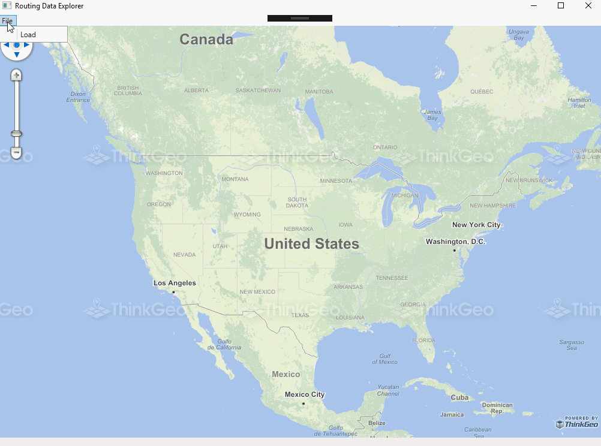

# Routing Data Explorer Sample for Wpf

### Description

This is a simple routing data viewer sample viewer which demonstrates how to use the RoutingEngine to get the shortest or fastest route in your Map Suite GIS applications.

How to use this tool:

 1. **Load rtg data:**
  Click menu "**File->Load**" browse to a rtg file. You also require a shapefile for the routing source file in the same folder, otherwise it display message "Could not find shp file in the same folder where you seleted".
 2. **Start routing:**
  Use left click for a start point and right click for an end point. If there is no route within **200** meters(you can modify this in source code), the explorer displays a message "There’s no road within 200 meters to where you clicked on".

This RoutingEngine supports routing in all of the Map Suite controls such as WinForms, Web, MVC and WebApi.

Please refer to [Wiki](http://wiki.thinkgeo.com/wiki/map_suite_desktop_for_wpf) for the details.



### Requirements
This sample makes use of the following NuGet Packages

[MapSuite 10.0.0](https://www.nuget.org/packages?q=ThinkGeo)

### About the Code
```csharp
var routingSource = new RtgRoutingSource(indexFileTextBox.Text);
var featureSource = new ShapeFileFeatureSource(routableFileTextBox.Text);
RoutingEngine routingEngine = new RoutingEngine(routingSource, featureSource);
routingEngine.SearchRadiusInMeters = 2000;
RoutingResult routingResult = routingEngine.GetRoute(startPoint, endPoint);

RoutingLayer routingLayer = new RoutingLayer();
routingLayer.StartPoint = startPoint;
routingLayer.EndPoint = endPoint;
routingLayer.Routes.Add(routingResult.Route);
```
### Getting Help

[Map Suite Desktop for Wpf Wiki Resources](http://wiki.thinkgeo.com/wiki/map_suite_desktop_for_wpf)

[Map Suite Desktop for Wpf Product Description](https://thinkgeo.com/ui-controls#desktop-platforms)

[ThinkGeo Community Site](http://community.thinkgeo.com/)

[ThinkGeo Web Site](http://www.thinkgeo.com)

### Key APIs
This example makes use of the following APIs:

- [ThinkGeo.MapSuite.Routing.RoutingEngine](http://wiki.thinkgeo.com/wiki/api/ThinkGeo.MapSuite.Routing.RoutingEngine)

### About Map Suite
Map Suite is a set of powerful development components and services for the .Net Framework.

### About ThinkGeo
ThinkGeo is a GIS (Geographic Information Systems) company founded in 2004 and located in Frisco, TX. Our clients are in more than 40 industries including agriculture, energy, transportation, government, engineering, software development, and defense.
