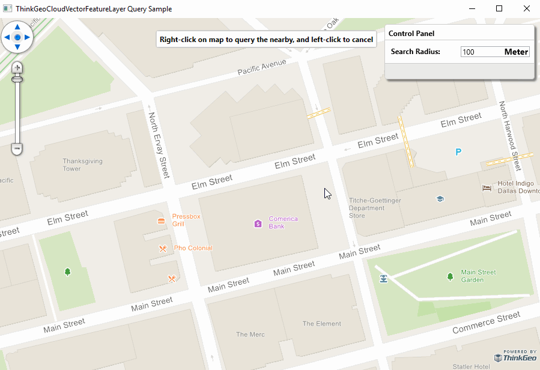

# Spatial Query With ThinkGeo Cloud Vector Maps Sample for Wpf

### Description

This sample demonstrates how you can query the features of Vector Tiles requested from ThinkGeo Cloud Services in your Map Suite GIS applications, such as searching the nearest places to your clicked place or the roads in the area with a specific distance you specified.

ThinkGeo Cloud Vector Maps support would work in all of the Map Suite controls such as Wpf, Web, MVC, WebApi, Android and iOS.

Please refer to [Wiki](https://wiki.thinkgeo.com/wiki/map_suite_desktop_for_wpf) for the details.



### Requirements
This sample makes use of the following NuGet Packages

[MapSuite 10.5.0](https://www.nuget.org/packages?q=ThinkGeo)

### About the Code
```csharp
if (e.MouseButton == MapMouseButton.Right)
{
    this.seachRadiusFeatureLayer.InternalFeatures.Clear();
    this.seachRadiusFeatureLayer.InternalFeatures.Add(new Feature(new EllipseShape(e.WorldLocation, int.Parse(this.txtSearchRadius.Text))));
    this.searchPointMarkerOverlay.Markers.Clear();
    this.searchPointMarkerOverlay.Markers.Add(GetMarkerByPlaceRecord(e.WorldLocation, "searchPoint", null));

    this.nearbysMarkerOverlay.Markers.Clear();

    Collection<Feature> selectedFeatures = SearchNearbyFeaturesByClickedLocation(e.WorldLocation, int.Parse(this.txtSearchRadius.Text));

    RenderSelectedFeatures(selectedFeatures);
    this.searchPointMarkerOverlay.IsVisible = true;
    this.nearbysMarkerOverlay.IsVisible = true;
    this.seachRadiusFeatureLayer.IsVisible = true;
}
else if (e.MouseButton == MapMouseButton.Left)
{
    this.seachRadiusFeatureLayer.IsVisible = false;
    this.searchPointMarkerOverlay.IsVisible = false;
    this.nearbysMarkerOverlay.IsVisible = false;
}

this.wpfMap.Refresh();
```
### Getting Help


[Map Suite Desktop for Wpf Wiki Resources](https://wiki.thinkgeo.com/wiki/map_suite_desktop_for_wpf)

[Map Suite Desktop for Wpf Product Description](https://thinkgeo.com/gis-ui-controls#wpf-platforms)

[ThinkGeo Community Site](http://community.thinkgeo.com/)

[ThinkGeo Web Site](http://www.thinkgeo.com)

### Key APIs
This example makes use of the following APIs:

Working...


### About Map Suite
Map Suite is a set of powerful development components and services for the .Net Framework.

### About ThinkGeo
ThinkGeo is a GIS (Geographic Information Systems) company founded in 2004 and located in Frisco, TX. Our clients are in more than 40 industries including agriculture, energy, transportation, government, engineering, software development, and defense.
