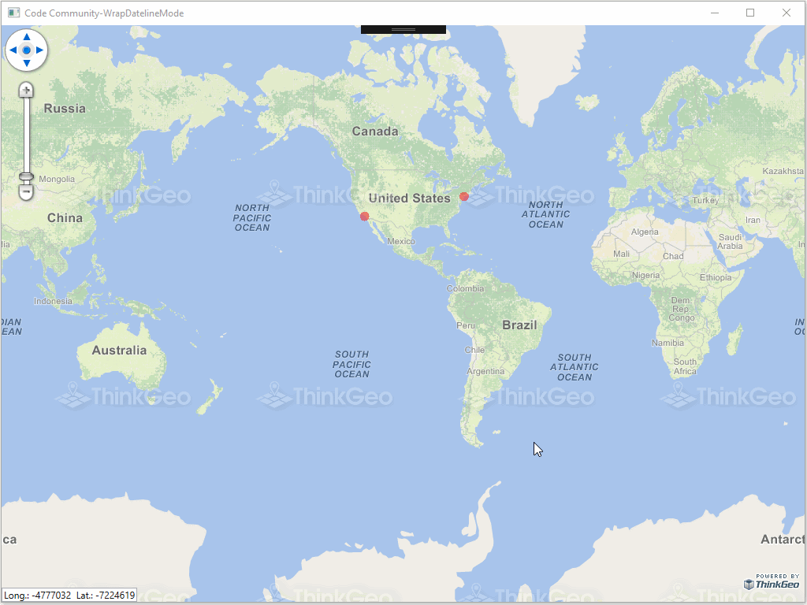

# Wrap Dateline Mode Sample for Wpf

### Description

In this Wpf project, we show a new property of Overlay, WrapDatelineMode. This property that allows to continuously pan west or east with world map was already available in the dev branch. This concept was shown in the previous sample “WrapDatelineMode”. Now it is fully supported in Map Suite 5 and you can see in this sample how the behavior for the map in both Decimal Degrees (Lat/Long) and Spherical Mercator (Google Map/Bing map projection). In order to run this sample, you will need the latest release for Wpf with references to MapSuiteCore.dll and WpfDesktopEdition.dll.

Please refer to [Wiki](http://wiki.thinkgeo.com/wiki/map_suite_desktop_for_wpf) for the details.



### Requirements

This sample makes use of the following NuGet Packages

[MapSuite 10.0.0](https://www.nuget.org/packages?q=ThinkGeo)

### About the Code
```csharp
class WrapDatelineProjection : Projection, IDisposable
{
    protected override Vertex[] ConvertToExternalProjectionCore(double[] x, double[] y)
    {
        Vertex[] vertices = new Vertex[x.Length];

        for (int i = 0; i < vertices.Length; i++)
        {
            if ((x[i] > HalfExtentWidth)|| (x[i] < (-HalfExtentWidth)))
            {
            double realx = GetAp(x[i]);
            vertices[i] = new Vertex(realx, y[i]);
            }
            else
            {
                vertices[i] = new Vertex(x[i], y[i]);
            }
        }
        return vertices;
    }
}
```
### Getting Help

[Map Suite Desktop for Wpf Wiki Resources](http://wiki.thinkgeo.com/wiki/map_suite_desktop_for_wpf)

[Map Suite Desktop for Wpf Product Description](https://thinkgeo.com/ui-controls#desktop-platforms)

[ThinkGeo Community Site](http://community.thinkgeo.com/)

[ThinkGeo Web Site](http://www.thinkgeo.com)

### Key APIs
This example makes use of the following APIs:

- [ThinkGeo.MapSuite.Shapes.Projection](http://wiki.thinkgeo.com/wiki/api/thinkgeo.mapsuite.shapes.projection)
- [ThinkGeo.MapSuite.Shapes.Vertex](http://wiki.thinkgeo.com/wiki/api/thinkgeo.mapsuite.shapes.vertex)

### About Map Suite
Map Suite is a set of powerful development components and services for the .Net Framework.

### About ThinkGeo
ThinkGeo is a GIS (Geographic Information Systems) company founded in 2004 and located in Frisco, TX. Our clients are in more than 40 industries including agriculture, energy, transportation, government, engineering, software development, and defense.
